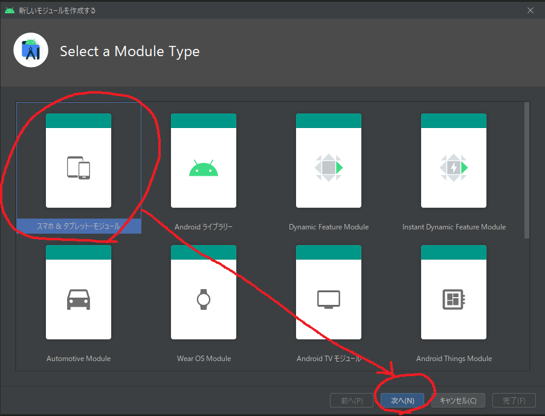
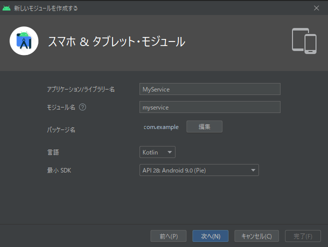
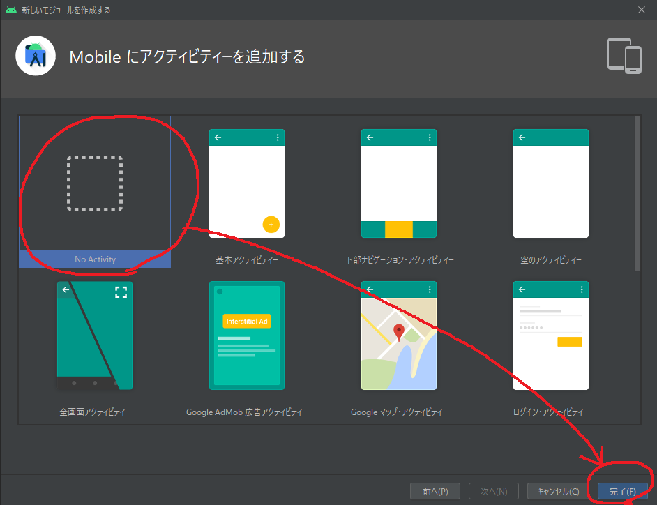
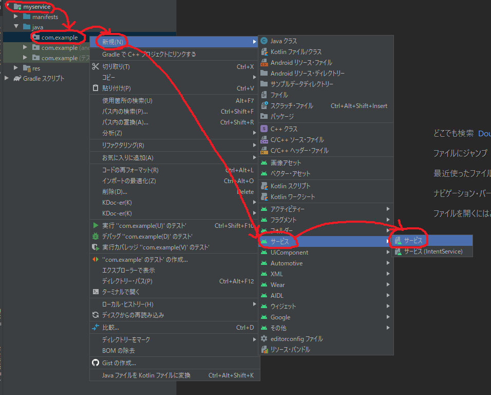
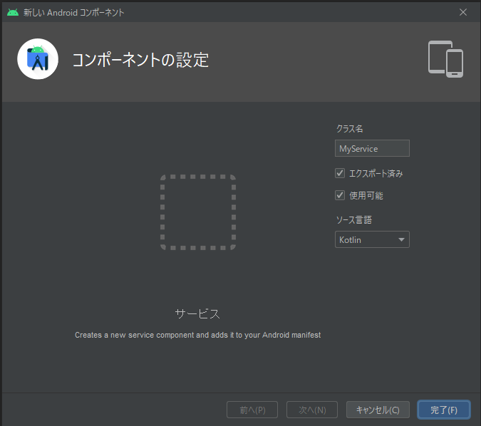
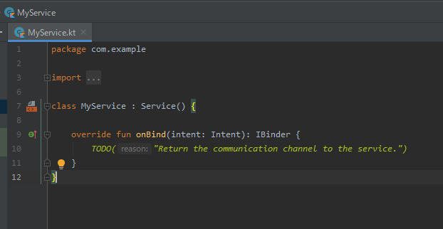
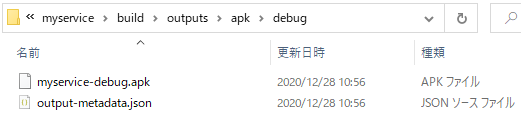
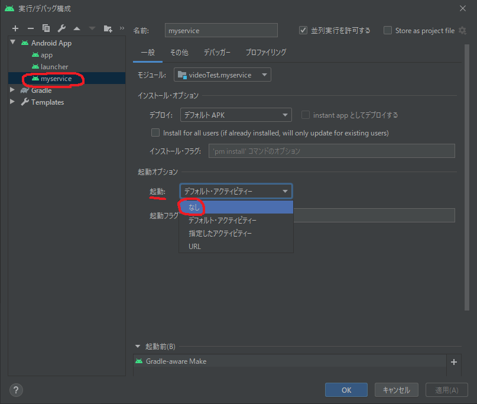

# Activityを持たないServiceのみのapkを作る

## やりたいこと
- adnroidのサービスを作りたい
- Activityは持たせたくない
    - サービス起動時に表示が一切出ないようにしておきたい
    - apkではなくaarのモジュールにすることでも実現できるが、署名で問題が残る
- 署名等の都合でapkにしておきたい
    - モジュールが必要とするpermissionの中に、platform署名やシステムアプリ権限が必要なものがある
    - システムアプリ権限を与えるためにはAndroidStudio UIからのインストールではダメで、adbコマンドを使ったり、AVDを書き込み権限付きで起動したりと手間が掛かることが分かっている
    - aarにした場合、このaarに依存するapkに対して署名やシステムアプリ化の作業が必要となってしまう
    - また、aarに依存するアプリのコードを変更をする度にapkの署名とシステムアプリ化作業が必要となるため、サービスの変更はサービスapkの中に閉じ込めておきたい
- トレードオフになる要素
    - Activity無しapk化したServiceの起動には、パッケージ名とサービスクラス名を指定したintentが必要になる点
        - 言い換えると、サービスapkの内部実装について起動する側が知ってしまう(事情が漏れてしまう)
        - Serviceを持つaarの場合、apkからaarに依存するため、サービス起動にはクラス参照を指定したintentを使うはず
    - 一般的にaarよりもapkの方がファイルサイズが大きくなる点

## 作成手順

### 新規モジュールの追加
- ファイル >> 新規 >> 新規モジュール >> スマホ＆タブレットモジュール



- パッケージ名、クラス名等を入力



### Activityのテンプレート選択
- **`No Activity`** を選択 >> 完了



### モジュールへのサービス追加
- `src/main/`配下に何も持たないモジュールが追加される
- Androidのサービスを追加する





- Serviceクラスを継承したユーザ定義クラスが生成される



### ビルド成果物の確認
- 追加したモジュールをビルドすると、`build/`配下にapkファイルが生成される



### 実行/デバッグ構成
- デフォルトでは実行/デバッグ構成の起動オプションで`デフォルト・アクティビティー`が選択されている
- Activityを持ったapkなら、ほとんどの場合`MainActivity`がデフォルト・アクティビティーとして起動する
- ServiceのみのapkではActivitiyが無いため、`デフォルト・アクティビティー`を選択した状態でapkをAndroidStudioから実行しようとした時、インストールはできるが存在しないActivityを起動しようとしてエラーが表示される
    - このエラー表示をしないためには起動のオプションで`なし`を選択しておく必要がある



### apkをandroid端末にインストールした後
- apkだがActivityを持たない都合上、端末UIのアプリ一覧にランチャーアイコンは表示されない
    - ランチャーアイコンが表示されるためには`AndroidManifest.xml`に以下のような`android.intent.category.LAUNCHER`の宣言が必要

```xml
<activity android:name=".MainActivity">
    <intent-filter>
        <action android:name="android.intent.action.MAIN" />
        <category android:name="android.intent.category.LAUNCHER" />
    </intent-filter>
</activity>
```

### サービスの起動方法
- 端末UIからは起動できないので、他のapkからintent等で起動する必要がある

