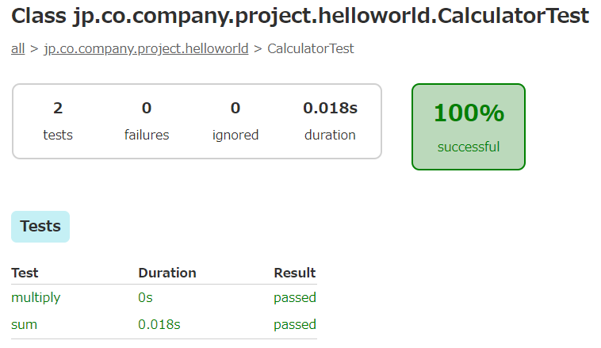

# androidでUnitTest
- AndroidStudioにおけるクラスの単体テスト作成、実行、レポート確認までの手順をまとめる
---
## 実装
- テストしたいクラスを実装する
- 以下の例ではCalculatorクラスのsum(), multiply()関数を実装する


## テスト作成
1. テスト対象のクラス(Calculator)を選択
2. Ctrl + Shift + T >> 新規テストの作成


3. 次のテスト・メソッドを作成 >> テストを作る関数にチェックON


4. android UIに関係の無いテストはandroidTestではなくtest配下へ


5. テストのスケルトンが自動生成される


6. assertEquals()等でテストを実装する


## テスト実行(AndroidStudio UIから)
- プロジェクトエクスプローラで対象となるファイル(CalculatorTest)を右クリック
- 実行(U) 'CalculatorTest'


- もしくは対象となるテストクラス名を右クリック
- 実行(U) 'CalculatorTest'


## テスト実行(コマンドから)
- AndroidStudioのターミナル等から以下のコマンドで単体テストを実行できる

```
graldew test
```

- クラスを指定して実行したい場合は以下の通り
	- ビルドバリアント値 : "Debug" or "Release" が入る

```
gradlew test{ビルドバリアント値}UnitTest --tests {テストクラス名}
```

- DebugビルドしたCalculatorTestクラスの単体テストを実行する場合
```
gradlew testDebugUnitTest --tests CalculatorTest
```


## テストレポートを確認
- `{projectRoot}/app/build/reports/tests/testDebugUnitTest/index.html`に出力される


---


---


