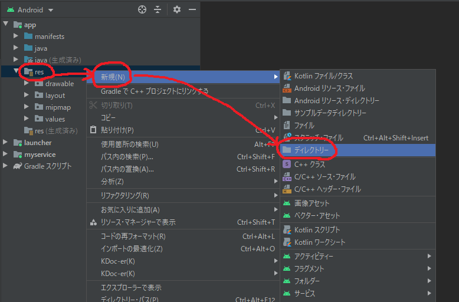
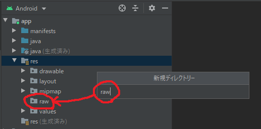
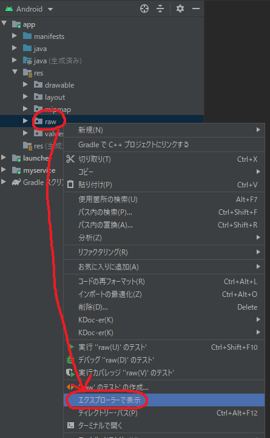
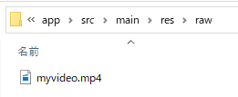

# AndroidStudioプロジェクトに動画ファイルをリソースとして追加する

## やりたいこと
- タイトルのまま
- 画像リソースはリソースマネージャから追加する手順が紹介されてるのをよく見かける
- 動画リソースについては見つけられなかったのでここでまとめておく

## 手順

### rawディレクトリを追加する





### rawディレクトリに動画ファイルをコピーする





### コードから動画リソースファイルを参照する
- `myvideo.mp4`なら、`R.raw.myvideo`でアクセス可能
- VideoView等にリソースのファイルパスを渡す場合は以下のようになる
    - [VideoViewでres/drawable内のファイルを再生する](https://qiita.com/ikneg_/items/63ac2966bf226934463b)

```kotlin
videoView.setVideoPath("android.resource://${this.getPackageName()}/${R.raw.myvideo}")
```