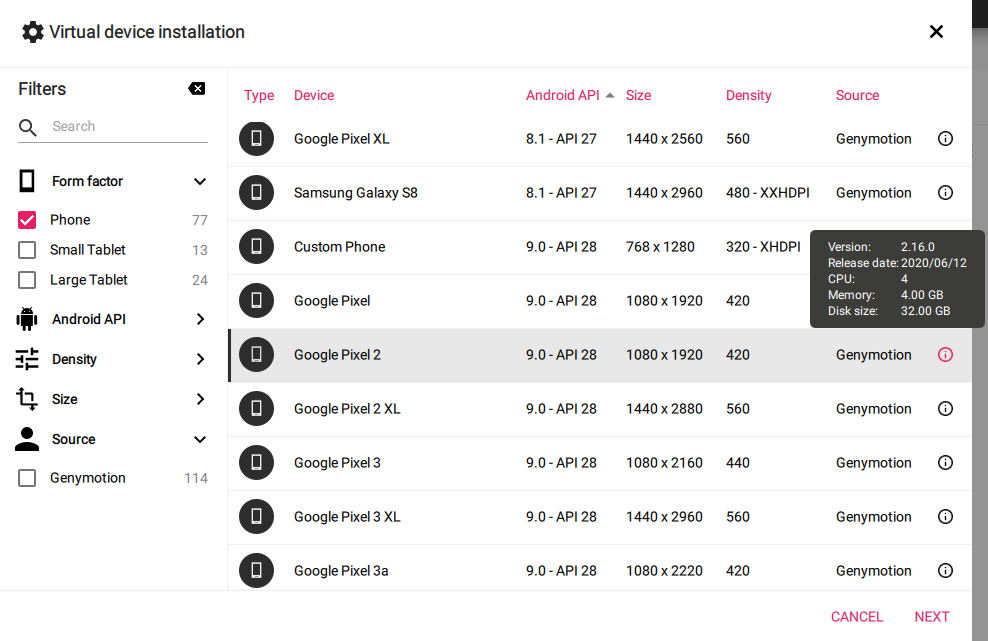
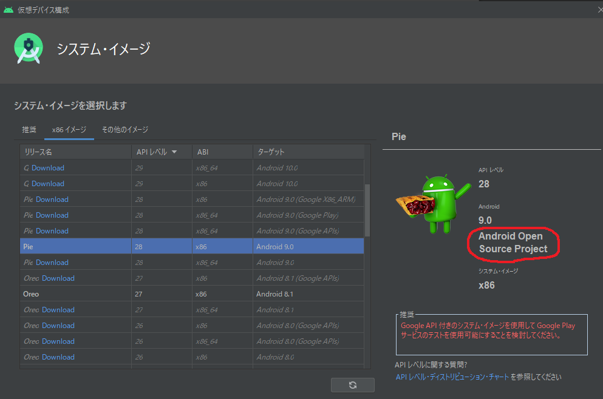
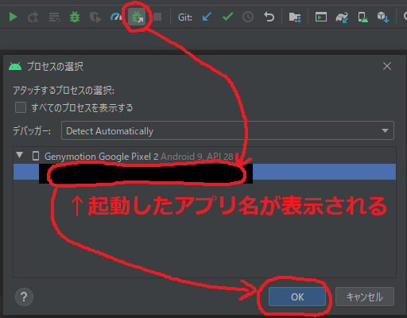
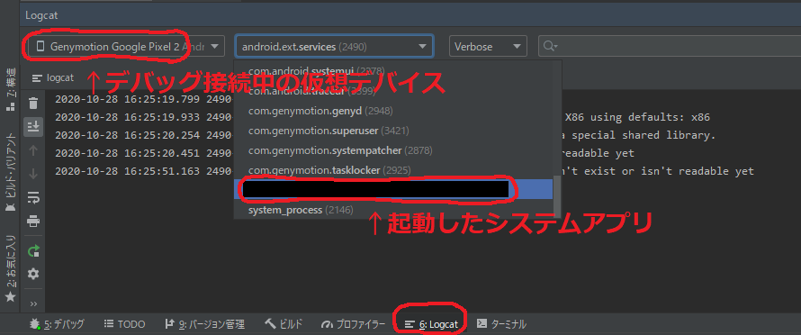
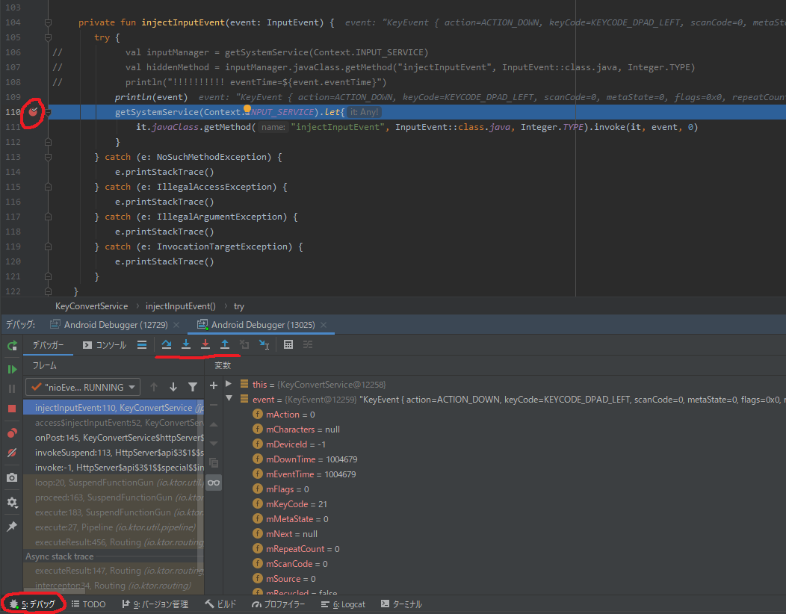

# dispatchKeyEvent()で拾えるキーイベントをアプリから任意に発行する

## やりたいこと
- View.dispatchKeyEvent()で拾えるAndroidOSのキーイベントを任意に発行するアプリを作りたい
- 発行したキーイベントは、foregroundで動いている他のapkも拾えるようにしたい

## 背景・経緯
- AndroidOS上でキーイベントを発行させる方法はいくつかあるが、同時に問題点もあった
  - Activity自身に自分向けのdispatchKeyEvent()を実行させる方法
    - キーイベントを拾いたいapkに余分なライブラリの依存を強制しなければならない
  - テスト向けの機能であるInstrumentationを使う方法
    - テスト向けなので製品コードで使うべきではない
    - 恐らく自分以外のapkにキーイベントを送信できない(と思われる)
  - inputコマンドをRuntime経由で実行させる方法
    - dalvikVMを起動するため動作が重い
    - 自分以外のapkにキーイベントを送信できない(と思われる)
- システムアプリやplatform署名といった制約は付くものの、真っ当な方法で実現することができたのでこのドキュメントにtipsとしてまとめた

## 実現の要件
- 実現に向けては実装以外にもいくつかの要件がある
  - 設定
    - AndroidManifest.xmlのINJECT_EVENTS permission
  - 実装
    - reflectionで取り出したinjectInputEvent()の呼び出し
    - injectInputEvent()に渡すKeyEventを正しく作成する
  - ビルドした後
    - apkに対するplatform署名
    - 署名済みapkのシステムアプリとしての配置
    - システムアプリのプリインストール

## 環境
- IDE: AndroidStudio4.0
- エミュレータ: genymotion
  - AndroidStudio標準のエミュレータでも書き込み可能なオプションを付けて起動は可能だが...
  - genymotionの方が軽量で、簡単に書き込み可能な状態にできたのでこちらを使って説明する
- アプリのターゲットOS: Android9.0(Pie, API28)
- httpserverフレームワーク: [ktor](https://ktor.io/)
  - 簡単にwebAPIを作れるので今回はktorを採用した
  - ktorのサーバ構築についてはこのドキュメントでは詳しくは触れない

## 制約
- システムアプリ要件とplatform署名要件のため、googleストアに並べるようなアプリでは実現できない
- root権限を取得したAndroid端末ならシステムアプリ要件はクリアできるが、platform署名要件がクリアできない
- AOSP(Android Open Source Project)でビルドしたシステムイメージを使った端末ならplatform署名要件もクリアできる
  - この制約が重いので、かなり業務用に近いtipsとなる

## 構成
- 以降で説明するサンプルの構成は以下の通り
- ディレクトリ構成は疑似的なもので、実際とは異なるので注意
```
.
├── client
│   ├── Client.kt
│   └── build
│       └── Client.apk  // Service.apkが発行したキーイベントを拾うapk
└── service
    ├── AndroidManifest.xml // INJECT_EVENTS permission 要件で追記が必要
    ├── Service.kt
    └── build
        ├── Service.apk // webAPIをキーイベントに変換・発行するサービスを起動するapk
        ├── platform.pk8        // platform署名要件で必要
        └── platform.x509.pem   // platform署名要件で必要
```

```plantuml
[Client.apk] as client
note right : OSが発行したキーイベントを拾う
[Service.apk] as service
note right : - apk起動時にforeground serviceを起動する\n- serviceはhttp serverでwebAPIを受け取る\n- webAPIを受信したらキーイベントをOSに発行する
() webAPI
() AndroidOS
webAPI -> service : http request
service --> AndroidOS : send key event
AndroidOS -> client : dispatchKeyEvent()
```

## 実現要件の解説

### AndroidManifest.xmlのINJECT_EVENTS permission
- `Service.apk`の`AndroidManifest.xml`に以下のpermission設定が必要
  - [[android] 端末にタッチイベントを動的に発生させる (touchをinjectionする方法)](https://qiita.com/solmin719/items/95cba1d8ade734fe7ce9#-まずはパーミッション追加)
  - [android.permission.INJECT_EVENTS](https://wiki.onakasuita.org/pukiwiki/?android.permission.INJECT_EVENTS)
```xml
<?xml version="1.0" encoding="utf-8"?>
<manifest xmlns:android="http://schemas.android.com/apk/res/android" package="xxxxxxxxxx">
    <!-- Androidサービスとして動かすために必要 -->
    <uses-permission android:name="android.permission.FOREGROUND_SERVICE"/>

    <!-- ktor等のhttpserverフレームワークのために必要 -->
    <uses-permission android:name="android.permission.INTERNET"/>

    <!-- 重要!! キーイベントをAndroidOSに送信するinjectInputEvent()の呼び出しに必要 -->
    <uses-permission android:name="android.permission.INJECT_EVENTS"/>
    ...
</manifest>
```

### reflectionで取り出したinjectInputEvent()の呼び出し
- [InputManager.injectInputEvent()を使う](https://qiita.com/solmin719/items/95cba1d8ade734fe7ce9#-方法1-inputmanagerinjectinputeventを使う)
```kotlin
internal class KeyConvertService : Service() {
    ...
    private fun injectInputEvent(event: InputEvent) {
        // INPUT_SERVICEの取得にContextへのアクセスが必要になるので、Serviceを継承したクラスの中で定義する必要がある点に注意
        // ktorで実装するhttpserverを別のktファイルに切り出しているなら、webAPIを受信した時に実行する処理をlistenerとして注入できる設計にしておくこと
        getSystemService(Context.INPUT_SERVICE).let{
            // reflectionで関数名injectInputEventを指定して取り出している
            // invoke()でinjectInputEventに引数を渡して呼び出し
            it.javaClass.getMethod("injectInputEvent", InputEvent::class.java, Integer.TYPE).invoke(it, event, 0)
    }
}
```
### injectInputEvent()に渡すKeyEventを正しく作成する
- ↑で定義したinjectInputEvent()の呼び出し例を示す
- ↓は`DPAD_LEFT`(矢印の左)キーを1回押下したことにするための呼び出し
  - 同じkeyCode(今回はKEYCODE_DPAD_LEFT)について、**ACTION_DOWN => ACTION_UPの順にinjectする**必要がある
    - これをACTION_DOWNのみ、ACTION_UPのみとかにするとdispatchKeyEvent()で拾えない
  - [KeyEventコンストラクタ](https://developer.android.com/reference/android/view/KeyEvent#public-constructors)には色々なoverrideが提供されているが、必須となる引数とそうでない引数がある
    - **`downTime`, `eventTime`, `action`, `code`は必須**だが、この4つだけのコンストラクタは無いので5つ目に`repeat`のあるコンストラクタを使っている
    - `downTime`, `eventTime`には`SystemClock.uptimeMillis()`で取得したシステム実行時間を入れればOK
    - `deviceId`, `scancode`, `flags`は省略可能
      - Androidエミュレータにフォーカスした状態でホストPCの物理キーボードを押下した時に発行されるKeyEventオブジェクトには`deviceId`, `scancode`, `flags`も設定されているが、無くてもOKだった
    - `metaState`はCtrl/Shift/Altキー等との同時押しのためにあるため、基本的には省略可能だが場合によっては自前で設定する必要がある
    - `downTime`, `eventTime`を省略した場合、`Dropped event because it is stale.`というログと共に発行したキーイベントは捨てられる
      - これは[services/inputflinger/InputDispatcher.cpp](https://android.googlesource.com/platform/frameworks/native/+/02769ac/services/inputflinger/InputDispatcher.cpp)の`InputDispatcher::isStaleEventLocked()`にてKeyEvent.eventTimeとシステム時刻を比較し、eventTimeから10秒以上経過している場合は古すぎるイベントと判断されるためである


```kotlin
// 現在のシステム時刻を取得
val time = SystemClock.uptimeMillis()
injectInputEvent(KeyEvent(time, time, KeyEvent.ACTION_DOWN, KeyEvent.KEYCODE_DPAD_LEFT, 0))
injectInputEvent(KeyEvent(time, time, KeyEvent.ACTION_UP, KeyEvent.KEYCODE_DPAD_LEFT, 0))
```

### apkに対するplatform署名
#### 付与したいpermissionの要件の調べ方
- `AndroidManifest.xml`で付与するpermissionが求める要件は、以下のadbコマンドをAndroidStudioターミナル等で実行することで調べることができる
```shell
adb shell pm list permissions -f
```

- ↑のadbコマンド出力結果から付与したいpermission文字列(今回は`INJECT_EVENTS`)を検索すると、以下のような情報が取得できる
  - 各項目の説明は[AndroidDeveloper : permission](https://developer.android.com/guide/topics/manifest/permission-element?hl=ja)で確認できる
  - `protectionLevel`に設定される値の詳細は[R.attr : protectionLevel](https://developer.android.com/reference/android/R.attr?hl=ja#protectionLevel)で確認できる
```shell
+ permission:android.permission.INJECT_EVENTS
  package:android
  label:null
  description:null
  protectionLevel:signature
```

- 今回注目すべきは`INJECT_EVENTS`の`protectionLevel`の値が`signature`となっている点
  - ここから`INJECT_EVENTS` permissionにはplatform署名が必要であると判断できる
  - [stackoverflow: Android INJECT_EVENTS permission](https://stackoverflow.com/a/22902808)の回答も参考になった
  - 日本語の記事だと[Qiita: Androidエミュレータでシステム署名が必要な処理の動作を確認する](https://qiita.com/le_skamba/items/a7a822846bae91ecc2f3)あたりとかも参考にした
    - システムアプリとplatform署名どちらか片方だけでOKみたいなことも書いてあるが、怪しい
> signature
> 
> 権限を宣言したアプリと同じ証明書がリクエスト元のアプリの署名に使用されている場合にのみシステムから付与される権限。
> 証明書が一致した場合、システムが自動的に権限を付与します。ユーザーに通知したり、ユーザーによる明示的な承認を求めたりすることはありません。

#### platform署名とは
- platform署名とは、Android端末の`/system/app/`や`/system/priv-app/`配下のapkと同じキーを使った署名のこと
- 署名の方法はplatformでない署名と全く同じで、使うキーがどこ由来なのかによってplatform署名となるか否かが変わる
- Android端末がgoogle製のPixelとかだったらPixelの開発者が使っているキーを使わないとplatform署名にはならない
- Android端末自体を開発しているプロジェクトの場合、恐らくシステム担当者がplatform署名のキーを作っているはずなので、そこから入手する必要がある

#### AOSPビルドされた仮想デバイスの選択
- Androidエミュレータで`Service.apk`の動作を確認する場合、AOSPでビルドされたシステムイメージを使っている仮想デバイスを選択する必要がある
- 今回はgenymotionの`Google Pixel2 Android9.0-API28`を使って確認した



#### GenymotionではなくAndroidStudio標準エミュレータで動作確認する場合
- AndroidStudio標準エミュレータの場合は以下のように`Android Open Source Project`の表記があるシステムイメージを選択してAVDを作成しておく必要がある
  - システムイメージ名に`Google Play`が付いているものは`Google Inc.`製なので`adb root`でroot権限が取得できない



- また、Genymotionと異なりAndroidStudioのGUIから起動する方法ではシステムアプリとしてのインストールはできないため、コマンドから起動する必要がある
- Android SDKの`emulator.exe`にパスが通っている必要があり、Windows環境変数の`Path`に`C:\Users\{username}\AppData\Local\Android\Sdk\emulator`を追加しておくこと
- `Sdk\tools\`にもemulator.exeがあり、こちらのパスが適用された場合は↓のエラーが発生してしまう
	- ["Missing emulator engine program for 'x86' CPU"が発生する場合の対処法 - たねやつの木](https://www.taneyats.com/entry/android_emulator_command_error)

- AVDのリストを確認する
```
emulator -list-avds
```

- `-avd`オプションでAVD名を指定し、`-writable-system`オプション付きで起動する
```
emulator -avd Pixel_2_API_28 -writable-system
```


#### AOSPビルドされた仮想デバイス向けのplatform署名キーを入手する
- [GitHub.com | aosp-mirror/platform_build](https://github.com/aosp-mirror/platform_build/tree/master/target/product/security)にAOSP標準の署名キーがある
- 素のAOSPでビルドされたシステムイメージを使っている端末であれば、↓のキーで署名すればplatform署名したことになる
  - `platform.pk8`
  - `platform.x509.pem`
- ↑のキーをダウンロードし、AndroidStudioでビルドした`Service.apk`と同じディレクトリに配置する

#### コマンドでapkにplatform署名する
- AndroidStudioのターミナルにて`apksigner`コマンドから署名する
  - [AndroidDeveloper | コマンドラインから手動でアプリに署名する](https://developer.android.com/studio/build/building-cmdline?hl=ja#sign_manually)
  - [AndroidDeveloper | apksigner](https://developer.android.com/studio/command-line/apksigner?hl=ja#usage-sign)
- Windowsの場合はapksigner.batから使うらしい
- `C:\Users\username\AppData\Local\Android\Sdk\build-tools\28.0.3\`に`apksigner.bat`があるので、ここに環境変数でpathを通す必要がある

```shell
apksigner sign --key platform.pk8 --cert platform.x509.pem Service.apk
```

#### apkに署名できたか確認する
```shell
keytool -printcert -jarfile Service.apk
```

### adbコマンドの基本

#### 仮想デバイスにログインする
```shell
adb shell
```

#### ホスト側から仮想デバイスに何かコマンドを実行させる
```shell
adb shell {some linux command}
```

#### 仮想デバイスからログアウトする
```shell
exit
```

### 署名済みapkのシステムアプリとしての配置
- ここまででキーイベントを送信するapkをビルドし、platform署名する所まで完了した
- 署名済みapkはAndroid端末のシステムアプリとして配置する必要がある
- AndroidStudioの実行/デバッグで仮想デバイスにインストールされた場合とは異なり、`/system/priv-app/{apk-name}/xxx.apk`として配置する必要がある
- まず、署名済みapkをインストールする仮想デバイスを起動しておく(今回はgenymotionで作ったGoogle Pixel2 - API28)
- AndroidStudioのターミナルにて、以下の`{apk-name}`を書き換えたコマンドを実行することで、仮想デバイスにapkを配置することが出来る

```shell
adb root && adb remount && adb shell mkdir /system/priv-app/{apk-name}/ && adb push {apk-name}.apk /system/priv-app/{apk-name}/
```

#### ↑のコマンドがやっていることの解説
- `&&`でadbコマンドを繋がずにバラバラに実行した場合、mkdirを実行した時点で/systemに対応するdeviceがread onlyに戻り、以降`adb remount`でも書き込み可能な状態に出来なくなってしまう(`adb reboot`等で仮想デバイスを再起動すれば再びadb remountが効くようになる)
- なので、**`&&`でadbコマンドを繋ぐのは必須**
```shell
// 仮想デバイスのroot権限を取得
adb root
```

```shell
// /systemディレクトリをmountしているdeviceを書き込み可能な状態にする
// /system/priv-app/配下にapkを保存するためには/systemを書き込み可能な状態にしなければならない
adb remount
```

```shell
vbox86p:/ # mount
...                                    ↓ 最初はro(=read only)になっているが...
/dev/block/sda6 on /system type ext4 (ro,seclabel,noatime,block_validity,delalloc,barrier,user_xattr)
```

```shell
vbox86p:/ # mount
...                                    ↓ adb remountにより書き込み可能になっている
/dev/block/sda6 on /system type ext4 (rw,seclabel,noatime,block_validity,delalloc,barrier,user_xattr)
```

```shell
// /system/priv-app/配下にapkを配置するディレクトリをapkと同じ名前で作成する
adb shell mkdir /system/priv-app/{apk-name}/
```

```shell
// ホスト側のapkファイルを仮想デバイスの/system/priv-app/{apk-name}/にコピーする
adb push {apk-name}.apk /system/priv-app/{apk-name}/
```

#### 標準エミュレータとgenymotionの違い
- genymotionの良い所
  - 軽量、低スペックPCでも何とか動いてくれる
  - 特に起動オプションを意識しなくても/system配下を書き込み可能に出来る
  - 再起動しても/system配下のファイルが初期化されない(後述するシステムアプリのプリインストールで必須)
- [AndroidDevelopers | コマンドラインからのエミュレータの起動](https://developer.android.com/studio/run/emulator-commandline#advanced)
	- `-writable-system`オプション付きでemulatorを起動すれば標準エミュでも/system/配下をrwに出来る

> -writable-system	
> エミュレーション セッション中に書き込み可能なシステム イメージを作成する際にこのオプションを使用します。方法は次のとおりです。
> -writable-system オプションを使用して仮想デバイスを起動します。
コマンド ターミナルから adb remount コマンドを入力し、system/ を読み取り / 書き込み用として再マウントするようにエミュレータに指示します（デフォルトでは読み取り専用としてマウントされます）。
このフラグを使用すると、システム イメージの一時的なコピーが作成されることにご注意ください。このコピーは非常に大きくなりますが（数百 MB）、エミュレータの終了時に破棄されます。

### システムアプリのプリインストール
- `/system/priv-app/`配下に保存したapkを仮想デバイスにインストールするためには、仮想デバイスの再起動が必要となる
  - 再起動すると、仮想デバイスUIのアプリ一覧に`Service.apk`が出てくる
  - 後は通常のアプリと同様にタップして起動すればOK
- AndroidStudio標準エミュレータをIDEから起動した場合、エミュレータ再起動で`/system/priv-app/`配下も初期化されるため、システムアプリのインストールはできない
  - なので今回はgenymotionの仮想デバイスを採用した
  - `-writable-system`オプション付きで起動した標準エミュレータが再起動で/system配下を初期化するか否かは未確認

### Client.apkの実装
- キーイベントをAndroidOSから受け取る`Client.apk`の実装は以下の通り
- ViewやActivityが持つ`dispatchKeyEvent()`をoverrideし、キーに応じた処理を実装するだけでOK
```kotlin
class MainActivity : AppCompatActivity() {
    override fun onCreate(savedInstanceState: Bundle?) {
        super.onCreate(savedInstanceState)
        setContentView(R.layout.activity_main)
    }
    override fun dispatchKeyEvent(event: KeyEvent?): Boolean {
        println("Client.apkでキーイベントを受信: keyEvent=${event}")
        // ここに受信したキーイベントに応じてやりたい処理を実装する
        return super.dispatchKeyEvent(event)
    }
}
```

## 署名済みシステムアプリのデバッグ方法
- インストール方法は通常のアプリとは異なったが、デバッグ方法はほぼ同じ

### システムアプリの起動
- 再起動した仮想デバイスのアプリ一覧から、`Service.apk`をタップしてアプリを起動

### AndroidStudioからデバッグ接続する



### デバッグ接続したアプリのprintln()出力を確認する
- Logcatで仮想デバイスとアプリを選択すればprintしたログも確認できる



### 処理をbreakして変数の中身等を確認する
- AndroidStudioでブレークポイントを貼れば処理を一時停止することもできる



## キーイベントを飛ばせる範囲
- platform署名の有無と、システムアプリか否かによってキーイベントを飛ばせる範囲が異なってくる
- Androidサービス(今回で言うと`Service.apk`)が発行したキーイベントを無関係な他のapk(今回で言うと`Client.apk`)に飛ばすには、platform署名とシステムアプリの両方が必須となる
- いずれか片方が欠けている場合、Androidサービスを起動したActivityにしかキーイベントを飛ばすことが出来なくなる

| platform署名 | システムアプリ | キーイベントを飛ばせる範囲  |
| :----------- | :------------- | :-------------------------- |
| o            | o              | 他のapkも可                 |
| o            | x              | 恐らく自分のapkのみ(未確認) |
| x            | o              | 自分のapkのみ               |
| x            | x              | 自分のapkのみ               |


