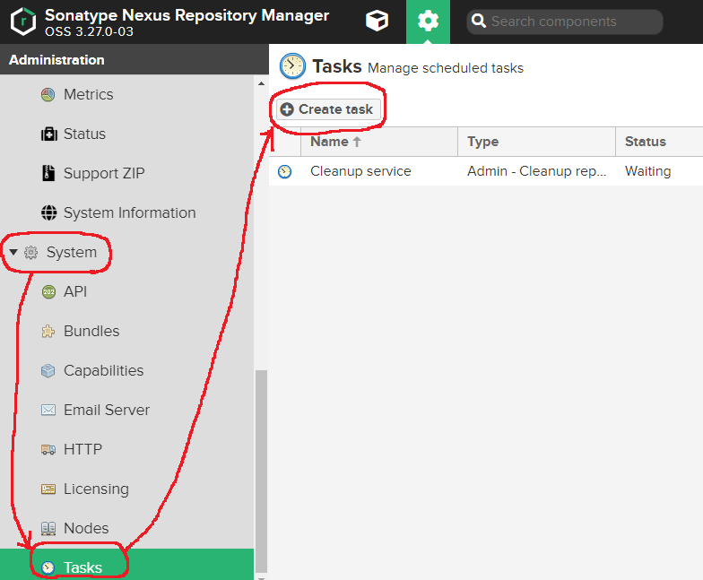
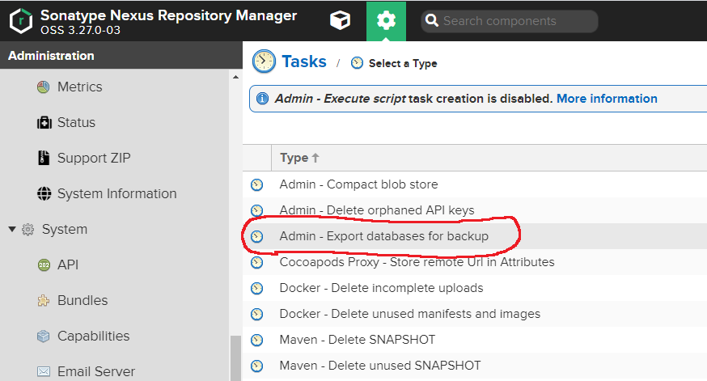
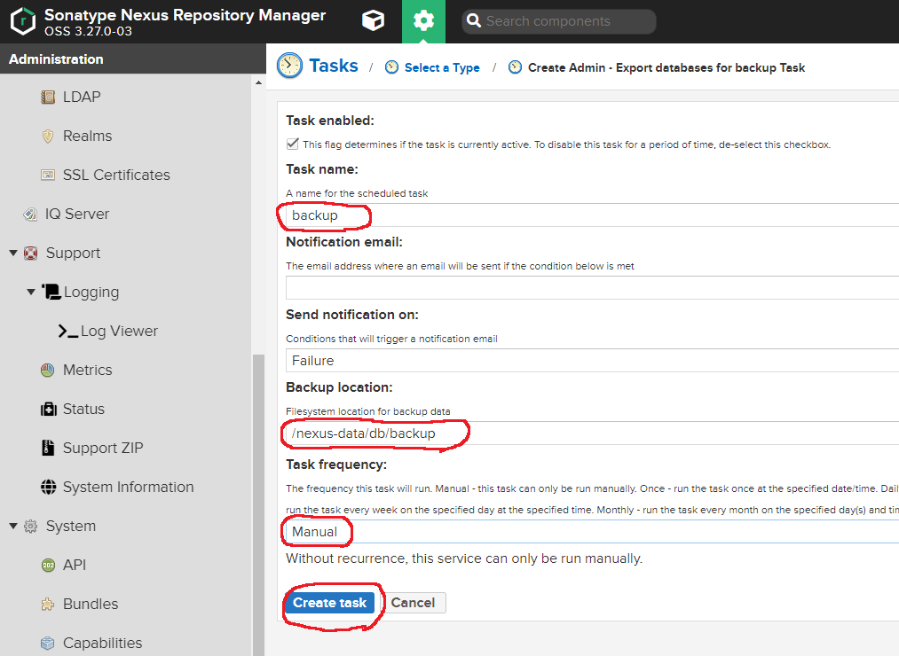
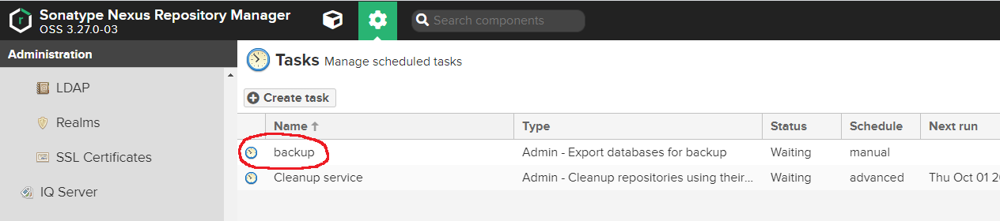
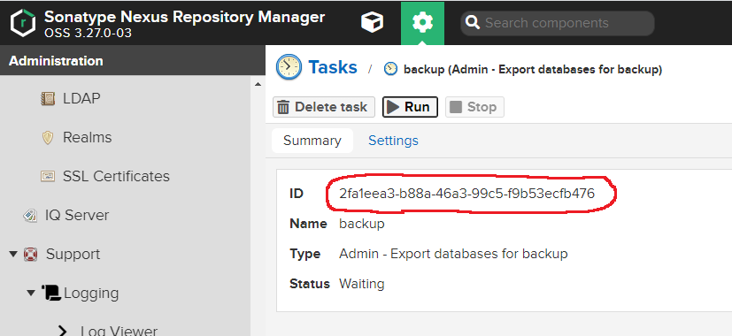
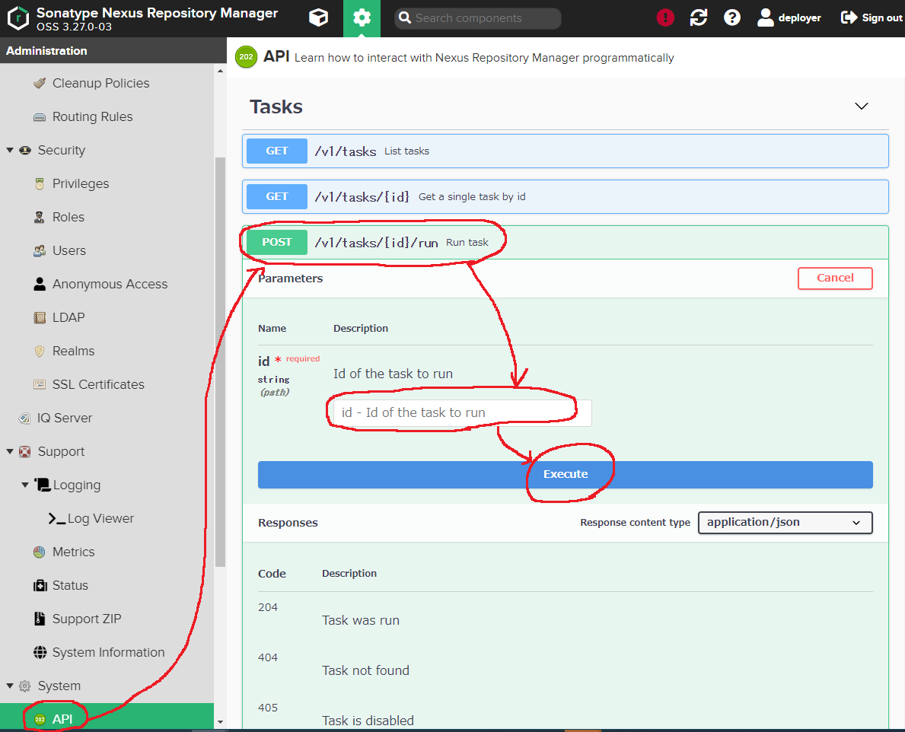

# nexus(mavenリポジトリ)のbackup + restore手順

## 前提条件
- 以下の`docker-compose.yml`のような構成であること
  - mavenリポジトリとして`sonatype/nexus3`を採用している
  - nexusコンテナ内の`/nexus-data`ディレクトリを`nexus_data`という名前の外部volumeに退避する
```yml
version: '3.7'
services:
    gitlab:
        build:
            context: ./gitlab/
            dockerfile: Dockerfile_gitlab
        restart: always
        container_name: mygitlab.com
        hostname: 'mygitlab.com:10080'
        environment:
            GITLAB_OMNIBUS_CONFIG: |
                gitlab_pages['inplace_chroot'] = true
                pages_external_url 'http://localhost:18080'
                gitlab_rails['external_url'] = "http://mygitlab.com:10080"
        volumes:
            - gitlab_etc:/etc/gitlab
            - gitlab_opt:/var/opt/gitlab
            - gitlab_log:/var/log/gitlab
        ports:
            - "10080:10080"
            - "10022:22"
            - "18080:18080"
    runner:
        image: gitlab/gitlab-runner:latest
        restart: always
        container_name: gitlab-runner
        volumes:
            - gitlab_runner_config:/etc/gitlab-runner
            - /var/run/docker.sock:/var/run/docker.sock
        depends_on:
            - gitlab
    maven:
        image: sonatype/nexus3
        hostname: mymaven.com
        container_name: mymaven.com
        ports:
            - "8081:8081"
        volumes:
            - nexus_data:/nexus-data
volumes:
    gitlab_etc:
        external: true
    gitlab_opt:
        external: true
    gitlab_log:
        external: true
    gitlab_runner_config:
        external: true
    nexus_data:
        external: true
```

## backup手順

### backupタスクの作成
- [Configure and Run the Backup Task](https://help.sonatype.com/repomanager3/backup-and-restore/configure-and-run-the-backup-task)
- nexusにブラウザから管理者ログイン >> System >> Taks >> Create task



- `Admin - Export databases for backup`のタスク選択



- Task name: 任意
- Backup location: `/nexus-data/db/backup`
  - ここで指定したディレクトリに`.bak`ファイルが生成されるようになる
- Task frequency: `Manual`
  - 他にも定期的な実行や1shotのみの実行が選択できる
- `Create task`ボタン押下でタスク作成は完了



- 作成したタスクの中身を確認する



- タスクの`ID`をメモしておく(後でAPIリクエストに使う)



- System >> API >> `/v1/tasks/{id}/run`でidを指定してbackupタスクを実行
	- タスクで指定したexport先に.bakファイルが作成される

```shell
curl -X POST "http://mymaven.com:8081/service/rest/v1/tasks/{id}/run" -H "accept: application/json"
```

!

### /nexus-dataのvolumeを圧縮
- dockerのnexus_data volumeをtarファイルに確保する
	- この圧縮でリポジトリのバイナリデータと、それ以外のデータ(ユーザアカウントやRole、作成したbackupタスク等)が確保される

```shell
## nexusに保存したjar等バイナリのbackup作成
docker exec --user root -t mymaven.com tar -cvzf /var/opt/$(date "+%s_%Y_%m_%d_%H_%M_%S_nexus_data.tgz") /nexus-data/
## nexus backupファイルを所定の位置に取り出す
docker cp mymaven.com:/var/opt/ ./backups/
## nexusコンテナ内のbackupで1週間以上経過した古いファイルを削除する
docker exec --user root -t mymaven.com find /var/opt/ -mtime +6 | xargs rm -rf
```


## restore手順
- nexus_data volumeのbackup.tarをmymaven.comコンテナのrootへコピーする
```shell
docker cp backups/nexus_backup.tar mymaven.com:/
```
- mymaven.comコンテナに入る
```shell
docker exec -it mymaven.com bash
```
- `/nexus-data/db/`に移動し、component, config, securityディレクトリを削除
	- [Restore Exported Databases](https://help.sonatype.com/repomanager3/backup-and-restore/restore-exported-databases)
```shell
cd /nexus-data/db && rm -rf component config security
```
- backup.tarファイルを展開
```shell
tar -xvzf /nexus_backup.tar
```

- .bakファイルを復元用ディレクトリにコピー
```shell
cp /nexus-data/db/backup/* /nexus-data/restore-from-backup
```

- (この手順必須かどうかまだ分からないけど)nexusを再起動
```shell
/opt/sonatype/nexus/bin/nexus restart
```

- mymaven.comコンテナを破棄して作り直す(nexus_data volumeはそのまま)
```shell
docker container stop mymaven.com
docker container rm mymaven.com
docker-compose up -d
```