# privateなmavenリポジトリを立てる

## 背景
- androidを使った製品開発プロジェクトにて、リポジトリを複数に分割した運用をしたい
- あるリポジトリで作るapkが、他のリポジトリのjar/aarに依存する場合がある
- jar/aarはインターネット上のmaven central等のpublicリポジトリには置きたくない

## やりたいこと
- 社内の閉じたネットワーク内にprivateなmavenリポジトリを立てたい
- jar/aarを作るリポジトリの成果物はこのprivate mavenリポジトリで管理したい
- 開発者ローカルのAndroidStudioでは、build.gradleに記述したprivate mavenリポジトリURL経由でjar/aarを取得したい
    - もちろん、jar/aarのバージョン指定も出来るように
- 構成管理のCIプロセスにて、ビルドしたartifact(jar/aar)をprivate mavenリポジトリに登録したい

## もしprivate mavenリポジトリが無かったら...
- jar/aarに依存するapkをビルドする際、逐一最新のjar/aarバイナリのコピーを入手しなければならない

## 導入~利用までの手順

### 1. nexus on dockerの起動
- sonatype製のバイナリリポジトリマネージャである[nexus](https://hub.docker.com/r/sonatype/nexus3)を使ってみる
- 競合としてよく比較されるのはjflog製のartifactory
    - DockerHubにてartifactory公式のdocker imageが見つけられなかったのでひとまずnexusを試す
- これらのサービスを使わず、[mavenの公式image](https://hub.docker.com/_/maven)を使う方法もある

#### 1.1. docker-compose.yml
- gitlab等、他に連携したいコンテナがあればそちらのdocker-compose.ymlのservicesにnexusを追加する
```yaml
version: '3.7'
services:
    nexus:
        image: sonatype/nexus3
        hostname: mynexus.com
        container_name: mynexus
        ports:
            - "8081:8081"
```

#### 1.2. nexusコンテナの起動
```
docker-compose up -d
```

#### 1.3. nexusへの接続確認
- webブラウザにて"http://localhost:8081"を開き、以下のようなページが表示されればnexusの起動はOK

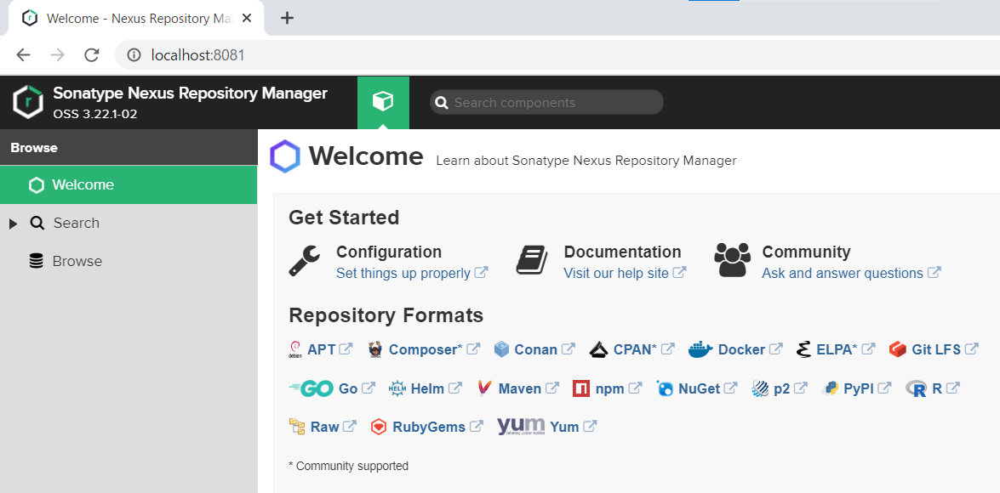

#### 1.4. nexusのadminユーザパスワード

- nexus home画面の右上Sign in押下でadminパスワードの入力を求められる
    - nexusコンテナの/nexus-data/admin.passwordファイルに書いてある文字列がパスワードになる
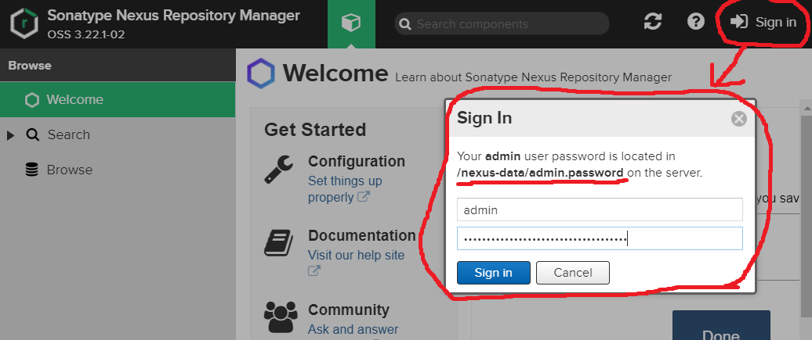

- docker-compose.ymlと同じディレクトリで以下を実行し、nexusコンテナに入る
```
docker exec -it mynexus bash
```

- adminパスワードを確認し、sign inの認証入力する
```
bash-4.4$ cat /nexus-data/admin.password 
5d19b8d9-2872-436e-8495-d855b7b46173
```

- この後、新しいadminパスワードの入力を求められる

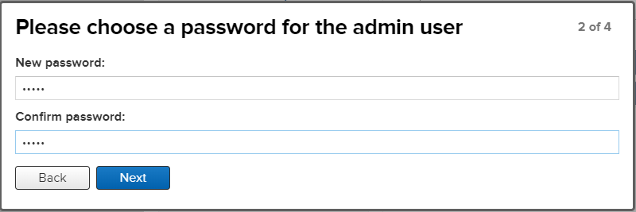

- anonymousユーザからのアクセスをどうするか聞かれる
    - 今回はenableとした

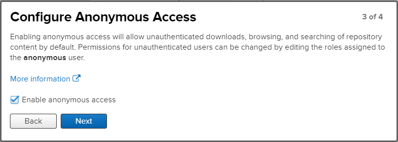

#### 1.5. nexusのdeployment policyについて
- 各リポジトリはdeployment policyを持っており、artifact登録時の挙動を設定できる
- maven-release
    - デフォルト設定は`Disable redeploy`であるため、同じversion値での再登録は失敗するようになっている
    - 先に誰かがversion='1.0.0'で登録すると、再度version='1.0.0'で登録できない
- maven-snapshot
    - デフォルト設定は`Allow redploy`であるため、同じversion値での再登録が可能となっている
    - version='1.0.0-SNAPSHOT'で何度でも再登録できる

#### 1.6. nexusのversion policyについて
- deployment policy同様、各リポジトリはversion policyを持ち、これにより登録されるバイナリのバージョン書式を制限する
- `release`: `1.2.0`のような`{major}.{minor}.{patch}`で構成されるバージョン書式が一般的だが、基本的にどんな書式でも許容される
- `snapshot`: `1.2.0-SNAPSHOT`のように末尾が`SNAPSHOT`であることが条件となる
  - nebula-releaseの`devSnapshot`タスクが作るバージョンは`1.1.0-dev.6+afce19e`のような書式であり、nexusのsnapshot version policyに反するためバイナリの登録が拒否されてしまう
- 次にリリースするバージョンが決まっているようなプロジェクトの場合は`snapshot`のpolicyで動く`maven-snapshots`リポジトリを使えば良いが、自動バージョニングを採用したプロジェクトの場合は次のバージョンが分からないため、`release`のpolicyで動くmavenリポジトリを新たに作る必要がある


### 2. artifact登録用nexusアカウント作成
#### 2.1. deploy専用Roleの作成

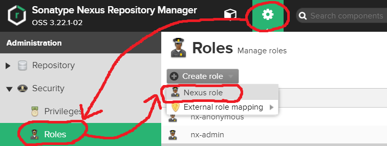

- 特権にはadminとviewがあり、uploadだけならviewにするべき
- maven-publicへのbrowseとreadは無くてもuploadできる
    - このRoleを適用したユーザでnexusにログインした時、maven-publicも閲覧できるようにしておく
- **デフォルトでないmavenリポジトリを追加した場合、Roleに新規リポジトリへの特権を追加しておく必要がある**
  - 後に`maven-devsnapshots`リポジトリを追加する手順があるので忘れずに

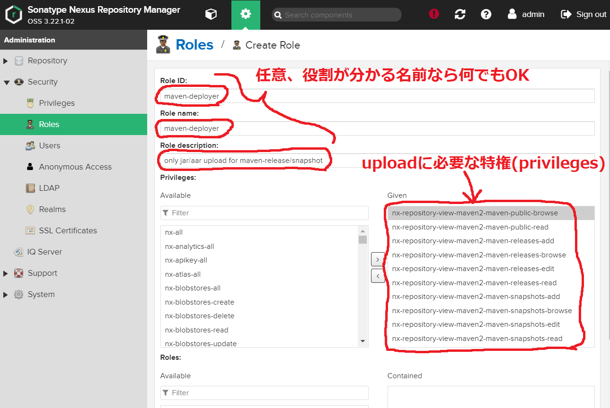

#### 2.2. deploy専用Userの作成

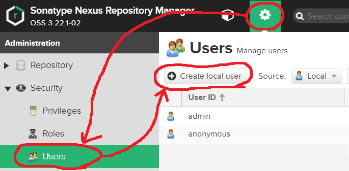

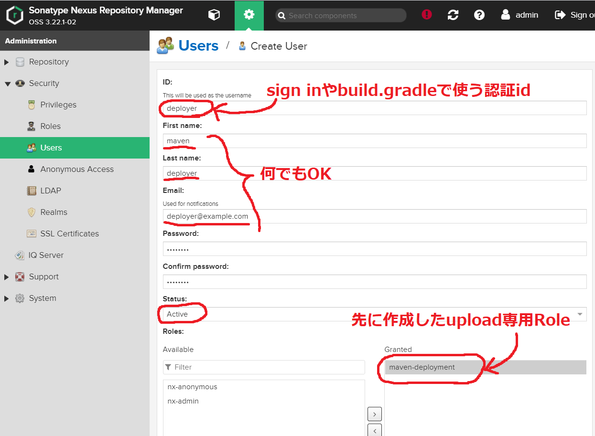

### 3. devsnapshotsリポジトリの追加
- 管理者権限でnexusにログインし、以下の設定で`maven-devsnapshots`リポジトリを作る


### 4. build.gradleからartifact登録
#### 4.1. mavenリポジトリとしてのURL確認
- nexusでRepositoriesを開き、以下のリポジトリがあることを確認する
    - maven-public
    - maven-releases
    - maven-snapshots
    - maven-devsnapshots
- 上記のリポジトリにjar/aarを登録しておき、build.gradleにてリポジトリURLを指定することになる

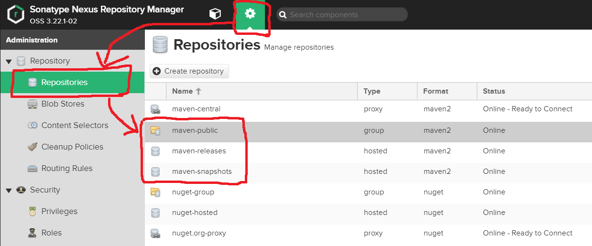

- 例えばmaven-publicを選択すると、リポジトリの情報が表示される
    - URLは"http://localhost:8081/repository/maven-public/"となる

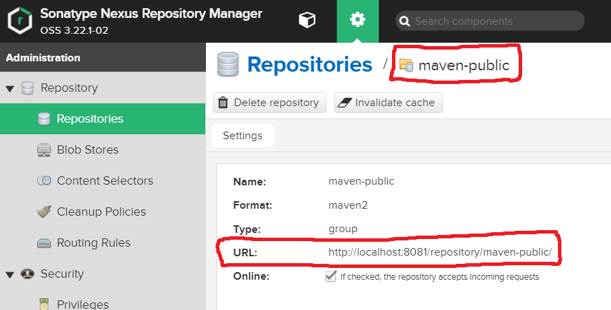

#### 4.2. AndroidStudioのプロジェクト構成(apk等に依存されるjar/aarを作る側)
- 以下のようなプロジェクト構成と仮定する
    - androidlibモジュールはandroidlib.aarを作る
```
project/
├── androidlib
│   └── build.gradle
├── build.gradle
└── maven_publish.gradle
```
#### 4.2.1. [maven_publish.gradle](https://github.com/zakuro0w0/android_templates/blob/master/ci-template/maven_publish.gradle)

```groovy
apply plugin: "nebula.maven-publish"

// nexusコンテナのURL
// nexusのコンテナ名とホスト名は共にmymaven.comにしておくこと
// CIコンテナからのアクセスはnexusコンテナ名:{ポート番号}で行われる
// nexusコンテナのlistenポート番号を80には出来ないので、CIコンテナからは8081でアクセスするしかない
// これに合わせて開発者localからのアクセスもポート番号指定で行う必要がある
ext.maven_url = 'http://mymaven.com:8081/repository'

// このmaven.gradleをapplyで取り込んだmoduleにて、
// implementationでnexusからpackageを取得できるようにするための定義
repositories {
    maven{
        url "${maven_url}/maven-public/"
    }
}

// nebulaによるrelease(finalやdevSnapshot)時に必要な設定
nebulaRelease {
    // デフォルトではmaster, releaseといった名前のbranchのみnebula releaseが許容されている
    // 今回nebulaでreleaseをするbranchにはproductionもいるため、branch名を追加する
    addReleaseBranchPattern(/production/)
}

// artifactをmavenにuploadするgradleタスクの定義
// 自動生成されるgradleタスク名はpublishNebulaPublicationToMavenRepositoryとなる
afterEvaluate{
    publishing {
        publications {
            nebula(MavenPublication) {
                pluginManager.withPlugin("com.android.application"){
                    // このgradleファイルをapplyしたモジュールがapkを作る場合
                    from components.release_apk
                }
                pluginManager.withPlugin("com.android.library"){
                    // このgradleファイルをapplyしたモジュールがaarを作る場合
                    from components.release
                }
                repositories{
                    maven{
                        def releaseReposUrl = "${maven_url}/maven-releases"
                        // master branchの時はsnapshotバージョンをuploadさせたい
                        // nebula devSnapshotが作るバージョンと、nexusのsnapshotバージョンポリシーが合わない(バージョン末尾が-SNAPSHOTにならない)ため、
                        // バージョンポリシーがrelease相当のmaven-devsnapshotsリポジトリをnexus上に作ってある
                        def snapshotReposUrl = "${maven_url}/maven-devsnapshots"
                        // `nebula -Psnapshot devSnapshot publishNebulaPublicationToMavenRepository`のような形式で-Pに続けて指定した文字列がpropertyとして認識される
                        // `-Psnapshot`を付けてpublishした場合はmaven-devsnapshotsへuploadさせる
                        // maven-gradleのチュートリアルでは`-Prelease`を付けてhasProperty('release')でURLを切り替える例が紹介されているが、これはnebulaでは使えない
                        // nebulaは最初からreleaseプロパティを持っているため、`-Prelease`を付けていなくてもhasProperty('release')がtrueになっていしまい、意図したURLが選択されない
                        url = project.hasProperty('snapshot') ? snapshotReposUrl : releaseReposUrl
                        // maven_urlが指すmavenリポジトリのサインイン情報
                        // 開発者はこのusername + passwordでmavenリポジトリを閲覧できる
                        credentials{
                            username = 'deployer'
                            password = 'deployer'
                        }
                    }
                }
            }
        }
    }
}
```

#### 4.2.2. androidlib/build.gradle
```groovy
apply from: rootProject.file('maven_publish.gradle')
```

#### 4.2.3. project/build.gradle
```groovy
plugins{
    id 'nebula.release' version '15.0.0'
    id 'nebula.maven-publish' version '14.0.0'
}
allprojects{
    apply plugin: 'nebula.release'
}
```


### 4.3. artifactをmavenリポジトリにupload
- AndroidStudioのTerminalにて以下のコマンドを実行する
    - 通常、mavenへのuploadはサーバ側のCIプロセスが行うので、開発者が実行することは無い(というかしてはならない)

#### 最新のgit tagをバージョンとして利用して`maven-releases`に登録する
```shell
gradlew -Prelease.useLastTag=true final publishNebulaPublicationToMavenRepository
```

#### 指定したバージョンで`maven-releases`に登録する
```shell
gradlew -Prelease.version=1.2.0 final publishNebulaPublicationToMavenRepository
```

#### 開発中バージョンで`maven-devsnapshots`に登録する
```shell
gradlew -Psnapshot devSnapshot publishNebulaPublicationToMavenRepository
```


#### 4.4. mavenリポジトリに登録した成果物をnexusで確認する

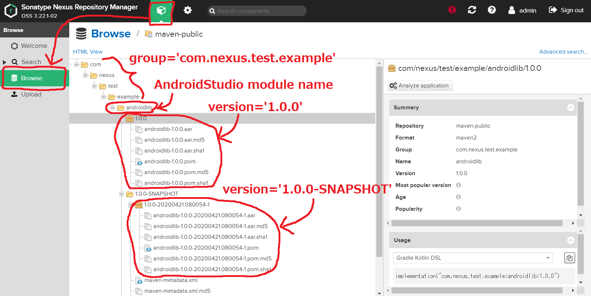

### 5. 登録したartifactをnexus経由で取得する

#### 5.1. AndroidStudioのプロジェクト構成(jar/aarに依存するapk側)

```
project/
├── app
│   └── build.gradle
├── build.gradle
└── maven.gradle
```
#### 5.2. project/app/build.gradle
- nexusのBrowseにてimplementationするためのコードを確認できる
    - 基本的には`implementation "{group}:{module}:{version}"`でOK
    - 開発中のバージョンが欲しい場合はversionを`1.0.0-SNAPSHOT`等にする

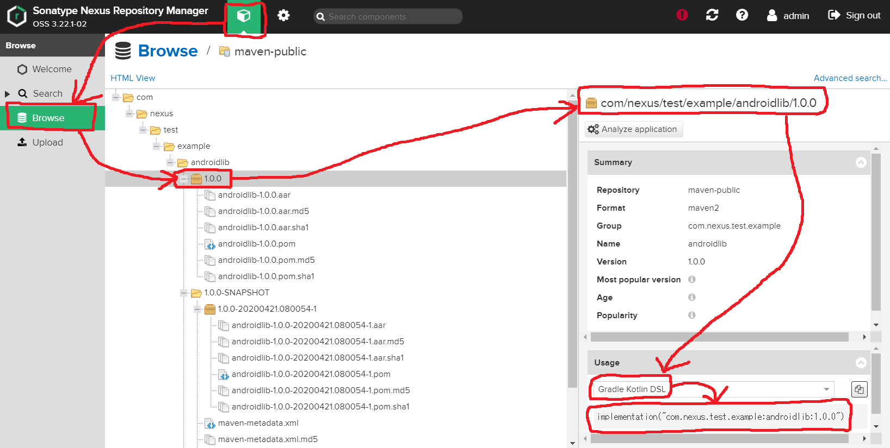

```
apply from: rootProject.file('maven.gradle')
dependencies {
    implementation("com.nexus.test.example:androidlib:1.0.0")
}
```

#### 5.3. gradleの同期を実行
- AndroidStudioにてgradle同期を実行すれば指定したnexusのURLからimplementationで指定したandroidlib.aarのver1.0.0を入手できる
- 同期に失敗する場合はURLやimplementationの記述にミスが無いか確認すること

## nexusコンテナのデータ容量に関する注意点

### nexusがuploadに対して500 Server errorを繰り返す
- 流石におかしいと思ってdockerコンテナを覗いてみた
- diskfull error的な何かが起きているらしい
- [Sonatype Nexus (3.12) が orientdb が壊れたとかで起動しなくなったら - Qiita](https://qiita.com/knjname/items/202d9bfdaa63fa85b0ea)
- [OrientDB corruption state in Nexus Repository version 3.2.0-01 - Stack Overflow](https://stackoverflow.com/questions/42951710/orientdb-corruption-state-in-nexus-repository-version-3-2-0-01)
- [What to Do When the Database is Out of Disk Space – Sonatype Support](https://support.sonatype.com/hc/en-us/articles/360000052388-What-to-Do-When-the-Database-is-Out-of-Disk-Space)
- [sonatype/nexus-oss - Gitter](https://gitter.im/sonatype/nexus-oss)
```
2020-07-21 06:28:59,117+0000 WARN  [qtp74878466-7737] deployer org.sonatype.nexus.repository.httpbridge.internal.ViewServlet - Failure servicing: PUT /repository/mavitted+41a65f7/myandroidlibrary-1.2.0-dev.1.uncommitted+41a65f7.aar
com.orientechnologies.orient.core.exception.OLowDiskSpaceException: Error occurred while executing a write operation to database 'component' due to limited free space. Please close the database (or stop OrientDB), make room on your hard drive and then reopen the database. The minimal required space is 4096 MB. Required space is kCache.diskFreeSpaceLimit) .
        DB name="component"

```

### nexusのデータ容量周りを調べる

- nexusコンテナの中で`df -kh`してみた
- `/nexus-data`配下が100%使われており、241MBしか残っていなかった
- が、この`/dev/sda2`はnexusコンテナをホストしているvcsサーバそのものだった
- ので、vcsサーバ自体で容量を食ってるから/nexus-dataに使える分が不足していることになる

```shell
$ docker exec -it mymaven.com bash
bash-4.4$ df -kh
Filesystem      Size  Used Avail Use% Mounted on
overlay          40G   37G  241M 100% /
tmpfs            64M     0   64M   0% /dev
tmpfs           7.9G     0  7.9G   0% /sys/fs/cgroup
/dev/sda2        40G   37G  241M 100% /nexus-data
shm              64M     0   64M   0% /dev/shm
tmpfs           7.9G     0  7.9G   0% /proc/acpi
tmpfs           7.9G     0  7.9G   0% /proc/scsi
tmpfs           7.9G     0  7.9G   0% /sys/firmware
```

- vcsサーバ上では/dev/sda2は`/`相当なので、どこでファイルが増えてもdockerコンテナの容量を圧迫する事になる
- 試しに~/docker/gitlab/backups/から古いバックアップを削除すると少し容量に余裕が出来た
- 元々容量が40GBと少ないこともあったが、バックアップを無暗に増やすのもよくなかった

```shell
$ df -kh
Filesystem      Size  Used Avail Use% Mounted on
udev            7.9G     0  7.9G   0% /dev
tmpfs           1.6G  1.6M  1.6G   1% /run
/dev/sda2        40G   35G  3.1G  92% /
tmpfs           7.9G     0  7.9G   0% /dev/shm
tmpfs           5.0M     0  5.0M   0% /run/lock
tmpfs           7.9G     0  7.9G   0% /sys/fs/cgroup
/dev/loop1       97M   97M     0 100% /snap/core/9436
tmpfs           1.6G     0  1.6G   0% /run/user/1000
/dev/loop2       97M   97M     0 100% /snap/core/9665
```

### nexusへのuploadが500 Server errorで失敗した時
- nexusコンテナのログを表示させる

```shell
docker container logs mymaven.com
```

- ↓のような`OLowDiskSpaceException`が出て無いか調べる
```
2020-07-21 06:28:59,117+0000 WARN  [qtp74878466-7737] deployer org.sonatype.nexus.repository.httpbridge.internal.ViewServlet - Failure servicing: 
PUT /repository/maven-releases/com/example/ci_sample/myandroidlibrary/1.2.0-dev.1.uncommitted+41a65f7/myandroidlibrary-1.2.0-dev.1.uncommitted+41a65f7.aar
com.orientechnologies.orient.core.exception.OLowDiskSpaceException: 
	Error occurred while executing a write operation to database 'component' due to limited free space on the disk (3176 MB). 

The database is now working in read-only mode. Please close the database (or stop OrientDB), 
make room on your hard drive and then reopen the database. The minimal required space is 4096 MB. 
Required space is now set to 4096MB (you can change it by setting parameter storage.diskCache.diskFreeSpaceLimit) .
```

- vcsサーバの残り容量を調べる

```shell
df -kh
```

- /dev/sda2の残り容量が98%とかだったら危険な状態なので、いらないファイルを整理する
- 主に~/docker/gitlab/backups/配下の古い日付のtgzを削除したりする

```shell
$ df -kh
Filesystem      Size  Used Avail Use% Mounted on
/dev/sda2        40G   35G  3.1G  92% /
```