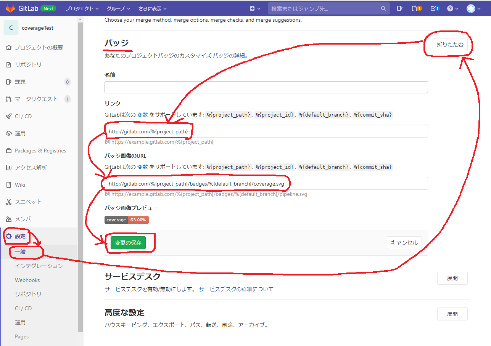
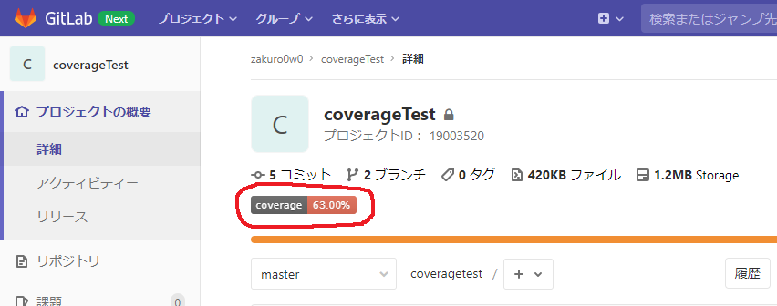

# robolectric + jacocoでカバレッジ測定

## やりたいこと
- AndroidTestとJUnitTestの両方をCIコンテナで実行し、カバレッジレポートを生成したい
- AndroidStudioのプロジェクトがマルチモジュールの場合、各モジュールのカバレッジレポートを1つにまとめたい
- 各モジュールのカバレッジ値が基準を満たしたか否かをチェックし、満たしていない場合はCIパイプラインのjobを失敗させたい
- モジュールのカバレッジを統合した総合カバレッジ値をgitlabに認識させ、カバレッジバッジをリポジトリTOPに表示したい

## 今回使うもの
- [jacoco](https://docs.gradle.org/current/userguide/jacoco_plugin.html)
    - カバレッジ測定
    - カバレッジレポート出力
    - カバレッジレポートの統合
    - カバレッジ基準値の合否判定
- [robolectric](http://robolectric.org/getting-started/)
    - AndroidTestをJUnitTestとして記述し、Androidデバイス無しでのテスト実行を可能にする
    - CIコンテナでのデバイスレステスト実行に必要
    - [robolectric 4.3.1](https://github.com/robolectric/robolectric/releases/tag/robolectric-4.3.1)の時点でAndroid API 29(Q)まで対応している

## 参考にしたWebサイト
- [Gradle6系 + Jacoco + マルチモジュール + フルKotlin + Android + Robolectric環境でユニットテストのカバレッジを出す](https://qiita.com/ryo_mm2d/items/e431326f701e74ec49fa#%E3%83%9E%E3%83%AB%E3%83%81%E3%83%A2%E3%82%B8%E3%83%A5%E3%83%BC%E3%83%AB)
- [Androidでコードカバレッジを計測する](https://developers.yenom.tech/entry/2018/04/15/152110)
- [マルチモジュールなAndroidプロジェクトでJaCoCoの設定を書く](https://subroh0508.net/articles/jacoco-scripts-in-anroid-muitl-module-project-by-kotlin-dsl)
- [GitLabにカバレッジバッジを貼る（GitLab CI+Gradle+JaCoCo）](https://taikii.net/posts/2019/02/gitlab-coverage-badge/)
    - gitlabカバレッジ解析の正規表現には記事で紹介している`^ - branch\s*:\s+(\d+\.\d+)%$`ではなく、gitlabがjacocoの場合に推奨する`Total.*?([0-9]{1,3})%`を使用する
- [The JaCoCo Plugin](https://docs.gradle.org/current/userguide/jacoco_plugin.html)
	- gradle jacocoの公式、javaプラグインを前提としているように見える
- [JacocoViolationRule (Gradle API 6.4.1)](https://docs.gradle.org/current/javadoc/org/gradle/testing/jacoco/tasks/rules/JacocoViolationRule.html)
	- jacocoCoverageVerificationで違反ルールを定義するために必要
- [android - jacocoTestCoverageVerificationを使用したAndroidチェックコードカバレッジしきい値 - ITツールウェブ](https://ja.coder.work/so/android/2497866)
	- Directoriesに指定するフィルタの定義はここから拝借した
- [Gradleのマルチプロジェクトのテスト結果とカバレッジをそれぞれ1つにまとめる - Qiita](https://qiita.com/suzutt/items/82aac3c8b9d7ce0c5cbb)
	- javaプロジェクトだが、JacocoReportを継承したカスタムタスクを作る上で必須となる要素がシンプルにまとまっている
- [JaCoCo Configuration using Gradle’s Kotlin DSL - Arunvel Sriram - Medium](https://medium.com/@arunvelsriram/jacoco-configuration-using-gradles-kotlin-dsl-67a8870b1c68)
	- kotlin DSLで記述している例
- [Improving Code Coverage In Android App - AndroidPub](https://android.jlelse.eu/improving-code-coverage-in-android-app-be8783370c1a)
- [Gradle Jacoco config for Android (3.x plugin) with kotlin and custom excludes support · GitHub](https://gist.github.com/almozavr/3cd46c4b4f0babbfc136db91924ab56e)

## ハマりポイントまとめ
- apply plugin: 'java'をしているか否かで事情が変わってくる
	- androidプロジェクトではjavaプラグインはapplyできない(共存できない)
	- javaプラグインとjacocoプラグインが両方applyされている場合、色々な記述を省略できるようになっている
		- jacocoTestReport, jacocoCoverageVerificationタスクも自動生成される
		- また、↑の自動生成タスクに対するadditionalSourceDirs, sourceDirectroies, classDirectories, executionDataの設定も不要になると思われる
	- androidプロジェクトでjacocoを使う場合、これらは自前で定義する必要がある
- executionData等のプロパティ設定
	- よく見かけた記事では=で上書き代入しているが、executionData.setFrom()で書き込まないと怒られた

## リポジトリ内で準備するファイル
- [リポジトリの詳細はGitLabで](https://gitlab.com/zakuro0w0/coveragetest)

### ディレクトリ構成
```
{repository}/
    ├── androidlib  // aarを作るmodule
    │   └── build.gradle
    ├── app         // apkを作るmodule
    │   └── build.gradle
    ├── build.gradle
    ├── coverage.gradle
    └── .gitlab-ci.yml
```

### {repository}/coverage.gradle
```groovy
apply plugin: "jacoco"

dependencies {
    testImplementation 'junit:junit:4.12'
    androidTestImplementation 'androidx.test.ext:junit:1.1.1'
    androidTestImplementation 'androidx.test.espresso:espresso-core:3.2.0'

    testImplementation 'androidx.test:core:1.2.0'
    testImplementation 'androidx.test:runner:1.2.0'
    testImplementation 'androidx.test:rules:1.2.0'
    testImplementation 'androidx.test.ext:junit:1.1.1'
    testImplementation 'androidx.test.ext:truth:1.2.0'
    testImplementation 'com.google.truth:truth:0.42'
    testImplementation 'org.robolectric:robolectric:4.3'
}

jacoco {
    toolVersion = "0.8.5"
}

android{
    testOptions {
        unitTests.all {
            jacoco {
                includeNoLocationClasses = true
            }
        }
        unitTests{
            includeAndroidResources = true
            returnDefaultValues = true
        }
    }
    buildTypes{
        debug{
            testCoverageEnabled true
        }
    }
    sourceSets{
        test.java.srcDirs += 'src/test/java'
        androidTest.java.srcDirs += 'src/androidTest/java'
    }
}

task jacocoMerge(
        type: JacocoMerge,
        group: "verification") {
    gradle.afterProject { project, _ ->
        if (project.rootProject != project && project.plugins.hasPlugin('jacoco')) {
            executionData "${project.buildDir}/jacoco/testDebugUnitTest.exec"
        }
    }
}

task jacocoMergedReport(
        type: JacocoReport,
        dependsOn: [tasks.jacocoMerge],
        group: "verification") {
    getExecutionData().from = jacocoMerge.destinationFile

    gradle.afterProject { project, _ ->
        if (project.rootProject != project && project.plugins.hasPlugin('jacoco')) {
            getSourceDirectories().from += "${project.projectDir}/src/main/java"
            getClassDirectories().from += project.fileTree(dir: "${project.buildDir}/tmp/kotlin-classes/debug")
        }
    }
    reports {
        xml.enabled = true
        html.enabled = true
    }
}

task jacocoTestCoverageVerification(
        type: JacocoCoverageVerification,
        dependsOn: 'jacocoMergedReport'
        group: 'verification') {
    onlyIf = { true }
    violationRules{
        rule{
            limit{
                minimum = 0.9
            }
        }
    }

    def coverageSourceDirs = [
            "src/main/java",
            "src/main/kotlin"
    ]

    def fileFilter = [
            '**/R.class',
            '**/R$*.class',
            '**/*$ViewInjector*.*',
            '**/*$ViewBinder*.*',
            '**/BuildConfig.*',
            '**/*_MembersInjector.class',
            '**/Dagger*Component.class',
            '**/Dagger*Component$Builder.class',
            '**/*Module_*Factory.class',
            '**/*_MembersInjector.class',
            '**/Dagger*Subcomponent*.class',
            '**/*Subcomponent$Builder.class',
            '**/Manifest*.*'
    ]

    def javaClasses = fileTree(
            dir: "${project.buildDir}/intermediates/javac/debug",
            excludes: fileFilter
    )
    def kotlinClasses = fileTree(
            dir: "${project.buildDir}/tmp/kotlin-classes/debug",
            excludes: fileFilter
    )

    additionalSourceDirs.setFrom(files(coverageSourceDirs))
    sourceDirectories.setFrom(files(coverageSourceDirs))
    classDirectories.setFrom(files([javaClasses], [kotlinClasses]))
    executionData.setFrom(fileTree(dir: "${project.buildDir}", includes: [
            "jacoco/testDebugUnitTest.exec",
            "outputs/code_coverage/debugAndroidTest/connected/*.ec",
            "outputs/code_coverage/connected/*.ec" //Check this path or update to relevant path
    ]))
}
```

### {module}/build.gradle

```groovy
apply from: rootProject.file('coverage.gradle')
```

### テスト対象となるソースコード
```kotlin
package com.example.mylibrary

import android.os.Bundle
import com.google.android.material.snackbar.Snackbar
import androidx.appcompat.app.AppCompatActivity

import kotlinx.android.synthetic.main.activity_main.*

class MainActivity : AppCompatActivity() {

    override fun onCreate(savedInstanceState: Bundle?) {
        super.onCreate(savedInstanceState)
        setContentView(R.layout.activity_main)
        setSupportActionBar(toolbar)
    }
    /**
     * xとyを掛けた値を返す
     */
    fun multiple(x: Int, y:Int) = x * y
}

/**
 * x + yを返す
 */
fun add(x: Int, y: Int) = x + y
```

### UnitTest.kt
- androidTestではなく、JUnitTest側に全てのテストケースを実装する
- Activityなどandroid要素のテストはandroidxの機能を使って記述する

```kotlin
package com.example.mylibrary

import androidx.test.core.app.ActivityScenario
import androidx.test.ext.junit.runners.AndroidJUnit4
import org.junit.Test
import org.junit.Assert.*
import org.junit.runner.RunWith

@RunWith(AndroidJUnit4::class)
class ExampleUnitTest {
    @Test
    fun myAndroidtest(){
        assertEquals(2, 1+1)
        val scenario = ActivityScenario.launch(MainActivity::class.java)
        scenario.onActivity {
            val value = it.multiple(2, 30)
            assertEquals(50, it.multiple(5, 10))
        }
    }

    @Test
    fun myJUnitTest(){
        assertEquals(10, add(3, 7))
    }

}
```

### .gitlab-ci.yml
```yml
image: jangrewe/gitlab-ci-android

variables:
  ANDROID_COMPILE_SDK: "28"
  ANDROID_BUILD_TOOLS: "28.0.2"
  ANDROID_SDK_TOOLS: "4333796"

before_script:
  - apt-get update --yes
  - apt-get install --yes wget tar unzip lib32stdc++6 lib32z1
  - export GRADLE_USER_HOME=${pwd}/.gradle
  - chmod +x ./gradlew

debugTests:
  stage: test
  script:
    ## ビルドする
    - ./gradlew assembleDebug

    ## UnitTestを実行する
    - ./gradlew testDebugUnitTest

    ## jacocoのカバレッジレポートを作成し、モジュール間のレポートを統合する
    - ./gradlew jacocoMergedReport

    ## 統合されたレポートの内容を標準出力に書き出す
    ## これはgitlabのリポジトリ >> 設定 >> CI/CD >> 一般のパイプライン >> テストカバレッジ解析 にて
    ## 指定した正規表現がCIパイプラインの標準出力から自動的にカバレッジ値を認識するために必要
    - cat app/build/reports/jacoco/jacocoMergedReport/html/index.html

    ## coverage.gradleで定義した基準を満たしいているか否かを各モジュールについて検査する
    ## 基準を満たさないモジュールが1個でも見つかればこのjobは失敗し、パイプラインは停止する
    ## リポジトリ >> 設定 >> 一般 >> マージリクエスト >> パイプラインは成功しなければならない に
    ## チェックを入れてあれば、パイプラインが不合格になったMRは承認できないため、カバレッジ基準を強制できる
    - ./gradlew jacocoTestCoverageVerification
  artifacts:
    paths:
      - app/build/reports/
      - mylibrary/build/reports/
```

## gitlab側で必要な準備
### CIパイプラインの出力からカバレッジ値を拾えるようにする

- テストカバレッジ解析用の正規表現
```
Total.*?([0-9]{1,3})%
```


### カバレッジバッジの表示設定をする
- リンク
```
http://gitlab.com/%{project_path}
```
- バッジ画像のURL
```
http://gitlab.com/%{project_path}/badges/%{default_branch}/coverage.svg
```



## 使い方(local開発環境)
- JUnitTestで定義したテストを実行して
```groovy
gradlew testDebugUnitTest
```

- 各モジュールのテスト結果を1つにまとめる
```groovy
gradlew jacocoMergedReport
```

- 今回試した時はapp配下のhtmlレポートにマージされていた
```
app/build/reports/jacoco/jacocoMergedReport/html/index.html
```

- カバレッジの検査を実行する
```
gradlew jacocoTestCoverageVerification
```

- coverage.gradleの基準を満たしていなかった場合、以下のようなログを出力してgradleタスクが失敗する
```
17:15:44: Executing task 'jacocoTestCoverageVerification'...

Executing tasks: [jacocoTestCoverageVerification] in project D:\programs\android\projects\MyRobolectricSample

> Task :app:jacocoMerge
> Task :app:jacocoMergedReport

> Task :app:jacocoTestCoverageVerification FAILED
[ant:jacocoReport] Rule violated for bundle app: instructions covered ratio is 0.5, but expected minimum is 0.9

FAILURE: Build failed with an exception.

* What went wrong:
Execution failed for task ':app:jacocoTestCoverageVerification'.
> Rule violated for bundle app: instructions covered ratio is 0.5, but expected minimum is 0.9
```

## 使い方(gitlab-ci環境)
- 該当のリポジトリをgitlabにpushするのみ
- CIパイプラインが成功すればリポジトリのTOPにカバレッジバッジが表示される



- カバレッジが基準を満たせていない場合はCIパイプラインは失敗し、カバレッジバッジには反映されない
