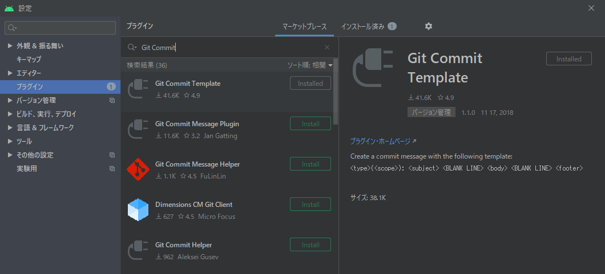

# 開発者local環境にcommitlintをinstallする手順

## 前提条件
- windows環境でAndroidStudioを使った開発を行う
- windows環境で以下が利用できる
    - [chocolatey](https://qiita.com/kangetsu121/items/b6352b547cd32e71bc65)
    - git for windows
    - powershell terminal(紹介するコマンドはpowershellで実行する)
    - ruby

## やりたいこと
- 開発者がgit commitする際、commitメッセージを[convenrionl commit](https://www.conventionalcommits.org/ja/v1.0.0-beta.4/)に準拠させる
- これにより、ビルドバイナリの自動バージョニングやリリースノートの自動生成を実現する
- [commitlint の紹介](https://qiita.com/ybiquitous/items/74225bc4bf0a9ddcd7dd#%E3%83%A1%E3%83%AA%E3%83%83%E3%83%88)
    - ここで挙げられているようなメリットも得られる

## 目指す構成
- AndroidStudioのGUIまたは任意のterminalで実行されたgit commitをgit hookがhusky経由でcommitlintに中継
- commitlintはcommitメッセージがconventional commitに準拠していないcommitを不合格にする(準拠するまでcommitが成功しない)

```plantuml
state 開発者local環境{
    state AndroidStudio{
        state GitCommitTemplate : 補助plugin
    }
    state terminal : 任意の端末
    state repository{
        state git_hook : {repository}/.git/hooks/*
        state npm_local{
            state husky : git hook生成用
        }
    }
    state npm_global{
        state commitlint : commit message解析
        state commitizen : commitlint準拠補助ツール
        state cz_customizable : commitizenのmenuカスタム
    }
}
AndroidStudio --> git_hook : git commit
terminal -> git_hook : git commit
terminal -> commitizen
commitizen --> cz_customizable
git_hook -> husky
husky --> commitlint
```

## 導入手順

### 1. windowsにnode.js環境(nvm + npm)を入手する
- 最終的にはnpmコマンドが動けば何でも良いので、分かる人は飛ばしてもOK
- chocolateyでnvmを入手する
```
choco install nvm
```

- terminalを開きなおす(nvm用環境変数のPATH適用)
- nvmコマンド動作確認
```
nvm version
```

- 利用可能なnode.jsのリストを確認
```
nvm list available
```

```
PS C:\Users\xxxx> nvm list available                         
                                                              
|   CURRENT    |     LTS      |  OLD STABLE  | OLD UNSTABLE | 
|--------------|--------------|--------------|--------------| 
|    14.2.0    |   12.16.3    |   0.12.18    |   0.11.16    | 
|    14.1.0    |   12.16.2    |   0.12.17    |   0.11.15    | 
|    14.0.0    |   12.16.1    |   0.12.16    |   0.11.14    | 
|   13.14.0    |   12.16.0    |   0.12.15    |   0.11.13    | 
|   13.13.0    |   12.15.0    |   0.12.14    |   0.11.12    | 
|   13.12.0    |   12.14.1    |   0.12.13    |   0.11.11    | 
|   13.11.0    |   12.14.0    |   0.12.12    |   0.11.10    | 
|   13.10.1    |   12.13.1    |   0.12.11    |    0.11.9    | 
|   13.10.0    |   12.13.0    |   0.12.10    |    0.11.8    | 
|    13.9.0    |   10.20.1    |    0.12.9    |    0.11.7    | 
|    13.8.0    |   10.20.0    |    0.12.8    |    0.11.6    | 
|    13.7.0    |   10.19.0    |    0.12.7    |    0.11.5    | 
|    13.6.0    |   10.18.1    |    0.12.6    |    0.11.4    | 
|    13.5.0    |   10.18.0    |    0.12.5    |    0.11.3    | 
|    13.4.0    |   10.17.0    |    0.12.4    |    0.11.2    | 
|    13.3.0    |   10.16.3    |    0.12.3    |    0.11.1    | 
|    13.2.0    |   10.16.2    |    0.12.2    |    0.11.0    | 
|    13.1.0    |   10.16.1    |    0.12.1    |    0.9.12    | 
|    13.0.1    |   10.16.0    |    0.12.0    |    0.9.11    | 
|    13.0.0    |   10.15.3    |   0.10.48    |    0.9.10    | 
```

- node.js + npm導入
```
nvm install v12.16.3
```
- 有効化(ubuntsuでは不要だったがwindowsでは必要らしい)
```
nvm use 12.16.3
```
- npmコマンドの動作確認
```
npm --version
```

### 2. npm global install

```ruby
`npm install -g @commitlint/cli commitizen cz-customizable`
`cp .czrc ~/`
```

- ~/.czrc
```
{ "path": "cz-customizable" }
```

### 3. リポジトリ毎に実行が必要なnpm local install
- 以下を各リポジトリのルートディレクトリで実行する
```ruby
## local install per repository
`npm init -y`
`npm install --save-dev husky @commitlint/config-conventional`

## commitlint config
`echo "module.exports = {extends: ['@commitlint/config-conventional']}" > commitlint.config.js`

## husky config
`echo "module.exports = {hooks: {'commit-msg': 'commitlint -e $HUSKY_GIT_PARAMS --verbose'}};" > husky.config.js`

## cz-customizable config
`cp .cz-customizable .`
```

- .cz-customizable
    - [本家のsampleを参考にした](https://github.com/leonardoanalista/cz-customizable/blob/master/cz-config-EXAMPLE.js)
```js
module.exports = {
  types: [
    { value: 'feat', name: 'feat:     A new feature' },
    { value: 'feat!', name: 'feat!:    A new feature with breaking change!!' },
    { value: 'fix', name: 'fix:      A bug fix' },
    { value: 'fix!', name: 'fix!:     A bug fix with breaking change!!' },
    { value: 'docs', name: 'docs:     Documentation only changes' },
    {
      value: 'style',
      name:
        'style:    Changes that do not affect the meaning of the code\n            (white-space, formatting, missing semi-colons, etc)',
    },
    {
      value: 'refactor',
      name: 'refactor: A code change that neither fixes a bug nor adds a feature',
    },
    {
      value: 'perf',
      name: 'perf:     A code change that improves performance',
    },
    { value: 'test', name: 'test:     Adding missing tests' },
    {
      value: 'chore',
      name:
        'chore:    Changes to the build process or auxiliary tools\n            and libraries such as documentation generation',
    },
    { value: 'revert', name: 'revert:   Revert to a commit' },
    { value: 'WIP', name: 'WIP:      Work in progress' },
  ],

  scopes: [{ name: 'accounts' }, { name: 'admin' }, { name: 'exampleScope' }, { name: 'changeMe' }],

  allowTicketNumber: false,
  isTicketNumberRequired: false,
  ticketNumberPrefix: 'TICKET-',
  ticketNumberRegExp: '\\d{1,5}',

  // it needs to match the value for field type. Eg.: 'fix'
  /*
  scopeOverrides: {
    fix: [

      {name: 'merge'},
      {name: 'style'},
      {name: 'e2eTest'},
      {name: 'unitTest'}
    ]
  },
  */
  // override the messages, defaults are as follows
  messages: {
    type: "Select the type of change that you're committing:",
    scope: '\nDenote the SCOPE of this change (optional):',
    // used if allowCustomScopes is true
    customScope: 'Denote the SCOPE of this change:',
    subject: 'Write a SHORT, IMPERATIVE tense description of the change:\n',
    body: 'Provide a LONGER description of the change (optional). Use "|" to break new line:\n',
    breaking: 'List any BREAKING CHANGES (optional):\n',
    footer: 'List any ISSUES CLOSED by this change (optional). E.g.: #31, #34:\n',
    confirmCommit: 'Are you sure you want to proceed with the commit above?',
  },

  allowCustomScopes: true,
  allowBreakingChanges: ['feat', 'fix', 'feat!', 'fix!'],
  // skip any questions you want
  skipQuestions: ['body'],

  // limit subject length
  subjectLimit: 100,
  // breaklineChar: '|', // It is supported for fields body and footer.
  // footerPrefix : 'ISSUES CLOSED:'
  // askForBreakingChangeFirst : true, // default is false
};
```

### 4. AndroidStudioへのplugin追加
- conventional commitに準拠するためのcommitメッセージ作成を補助するpluginを追加する
- AndroidStudio起動 >> メニュー >> ファイル >> 設定 >> プラグイン >> マーケットプレース >> "Git Commit Template"を検索 >> Install




## commitlintの動作確認

### terminalからコマンドで
- commitlint導入手順を終えたgitリポジトリ配下に移動
- conventional commitに不合格となるメッセージを空commitする
```
git commit -m "foo:bar" --allow-empty
```

- 以下のように準拠できてない指摘が出てcommitが却下されればOK
```
/mnt/d/programs/vscode/projects/githooktest$ git commit -m "foo:bar" --allow-empty
husky > commit-msg (node v12.16.3)
⧗   input: foo:bar
✖   subject may not be empty [subject-empty]
✖   type may not be empty [type-empty]

✖   found 2 problems, 0 warnings
ⓘ   Get help: https://github.com/conventional-changelog/commitlint/#what-is-commitlint

husky > commit-msg hook failed (add --no-verify to bypass)
```

### AndroidStudioからGUIで
- terminalからの確認と同様、commitlint導入手順を終えたgitリポジトリをAndroidStudioで開く
- 任意のファイルを適当に変更した後、GUIからgit commitする(commitメッセージは"foo:bar"等、commitlintで不合格になるものを入力)
- 以下のようにcommitが却下されればOK

