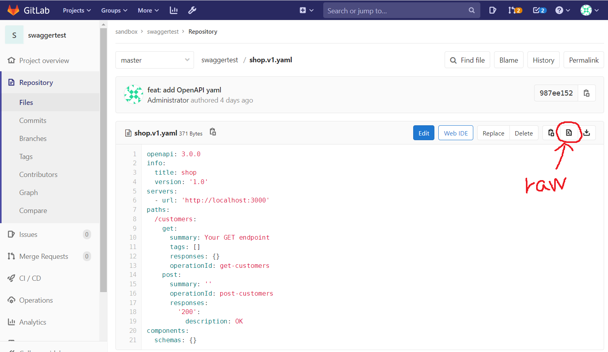
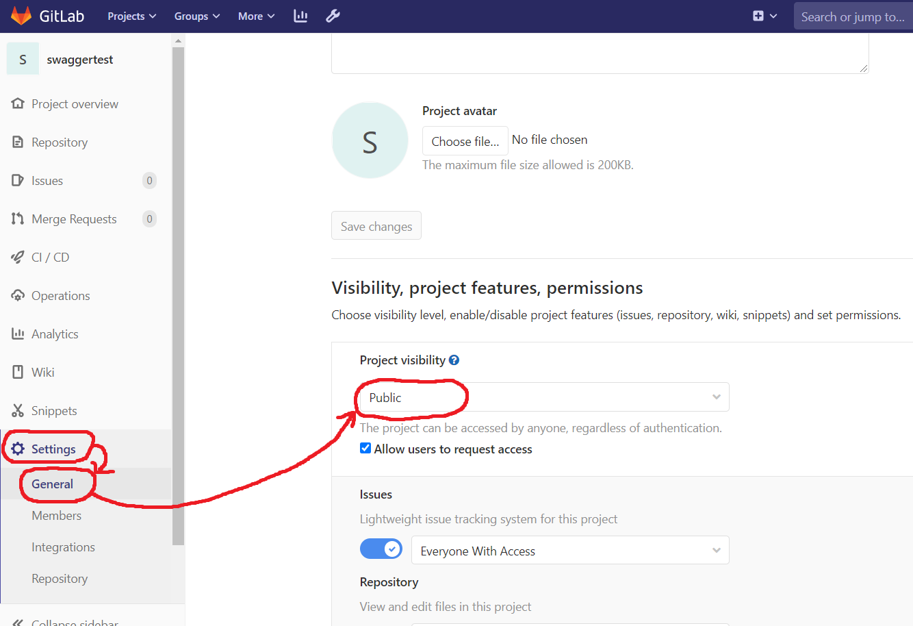
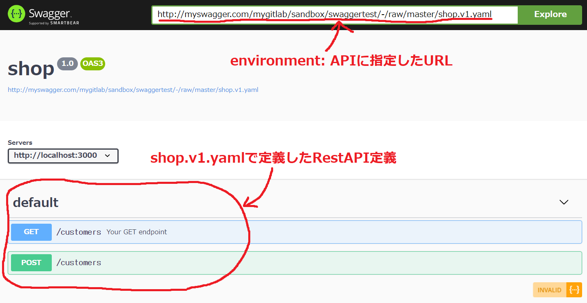

# gitlabのOpenAPI準拠ymlをswagger-uiで描画する

## やりたいこと
- プロジェクトのRestAPIインターフェース定義をOpenAPI準拠で行いたい
- OpenAPI準拠のymlファイルで記述し、swaggerを使った表示をしたい
- これにより、Excelで定義する従来の古いやり方を一掃する

## 参考リンク
- [Swagger UIでGitLabで管理された定義書を参照する](https://qiita.com/skkojiko/items/ec9cd28df8bb64c3d92a)
- [【docker】starting container process caused "exec: "bash"エラーがでる場合はshを指定する](https://qiita.com/k-kurikuri/items/fe8d56e1d4bc96418576)
    - swaggerコンテナに入る時はbashではなくshにする必要がある

## リポジトリ内で準備するファイル
### ディレクトリ構成
```
gitlab/
├── Dockerfile_gitlab
├── Dockerfile_swagger
├── docker-compose.yml
├── reverse_proxy_default.conf
└── swagger_nginx.conf
```

### swagger_nginx.conf
- /etc/nginx/nginx.confとしてコピーされるファイル
- swagger-ui imageで作るコンテナのnginx.confは/etc/nginx/conf.d/default.confをincludeしていない
- このため、nginx.confに変更を加える必要があるが、docker-compose.ymlでのvolumeでnginx.confは上書きできなかった(コンテナ起動時にresource busyとなる)
- よって、今回はDockerfileとしてnginx.confを上書きしたimageを自作することにした

```
worker_processes      1;

events {
    worker_connections  1024;
}

http {
    include             mime.types;
    default_type        application/octet-stream;
    sendfile on;
    keepalive_timeout   65;

    gzip on;
    gzip_static on;
    gzip_disable "msie6";
    gzip_vary on;
    gzip_types text/plain text/css application/javascript;

    map $request_method $access_control_max_age {
        OPTIONS 1728000; # 20 days
    }

    server {
        listen            8080;
        server_name       localhost;
        index             index.html index.htm;

        ## デフォルトのnginx.confに追加したブロック
        ## localhost:8080/mygitlab/へのアクセスをgitlabに飛ばす
        ## swaggerコンテナからgitlabのファイルを参照するために必要な設定
        location /mygitlab/ {
            proxy_pass  http://mygitlab.com/;
        }

        location / {
            absolute_redirect off;
            alias            /usr/share/nginx/html/;
            expires 1d;
            location ~* \.(?:json|yml|yaml)$ {
                expires -1;

                include cors.conf;
            }
          include cors.conf;
        }
    }
}
```

### Dockerfile_swagger
```
FROM swaggerapi/swagger-ui
## swagger用のconfファイルをnginx.confファイルとしてコピーする
COPY swagger_nginx.conf /etc/nginx/nginx.conf
```

### docker-compose.yml
```yml
version: '3.7'
services:
    gitlab:
        build:
            context: .
            dockerfile: Dockerfile_gitlab
        restart: always
        container_name: mygitlab.com
        hostname: 'mygitlab.com'
        ports:
            - "10080:80"
        volumes:
            - gitlab_etc:/etc/gitlab
            - gitlab_log:/var/log/gitlab
            - gitlab_opt:/var/opt/gitlab
    nginx-proxy:
        image: nginx:latest
        container_name: myproxy
        restart: always
        ports:
            - "80:80"
        volumes:
            - ./reverse_proxy_default.conf:/etc/nginx/conf.d/default.conf
    swagger:
        build:
            context: .
            dockerfile: Dockerfile_swagger
        hostname: myswagger
        container_name: myswagger
        restart: always
        ports:
            - "8080:8080"
        environment: 
            ## swaggerのページを開いた時にデフォルトで表示したいymlファイルのURLを指定する
            ## gitlabのファイルを指定する場合、swagger_nginx.confで定義したproxy_passが動くようにURLを指定すること
            ## また、gitlabのファイル参照はrawデータのURLを指定しないといけない(htmlの方を指定するとymlのparse処理でエラーが起きる)
            API_URL: http://myswagger.com/mygitlab/sandbox/swaggertest/-/raw/master/shop.v1.yaml
volumes: 
    gitlab_etc:
        external: true
    gitlab_opt:
        external: true
    gitlab_log:
        external: true
```

### reverse_proxy_default.conf
```
# nginxのconfファイルは末尾にセミコロンが無いとコンテナ起動に失敗する

## hostsファイル
## ```
## 127.0.0.1 localhost
## 127.0.0.1 mygitlab.com
## 127.0.0.1 mymaven.com
## 127.0.0.1 myswagger.com
## ```

server {
    listen 80;
    # nginxのサーバ名(ホストPCのhostsファイルで名前解決しておくこと)
    server_name mygitlab.com;

    proxy_set_header Host $host;
    proxy_set_header X-Real-IP $remote_addr;
    proxy_set_header X-Forwarded-Host $host;
    proxy_set_header X-Forwarded-Server $host;
    proxy_set_header X-Forwarded-For $proxy_add_x_forwarded_for;

    # "http://mygitlab.com"へのアクセスに対してどうするかを設定する
    location / {
        # 以下、proxy_passによる転送の設定
        ## ホストPC(host.docker.internal)の指定ポート番号に転送する
        proxy_pass http://host.docker.internal:10080;
    }
}

server {
    listen 80;
    # nginxのサーバ名(ホストPCのhostsファイルで名前解決しておくこと)
    server_name myswagger.com;

    proxy_set_header Host $host;
    proxy_set_header X-Real-IP $remote_addr;
    proxy_set_header X-Forwarded-Host $host;
    proxy_set_header X-Forwarded-Server $host;
    proxy_set_header X-Forwarded-For $proxy_add_x_forwarded_for;

    # "http://mygitlab.com"へのアクセスに対してどうするかを設定する
    location / {
        # 以下、proxy_passによる転送の設定
        ## ホストPC(host.docker.internal)の指定ポート番号に転送する
        proxy_pass http://host.docker.internal:8080;
    }
}
```

## リポジトリ外で準備するファイル
### shop.v1.yml
- セルフホストしたmygitlab.comのリポジトリに以下のようなOpenAPI準拠のymlファイルを保存しておく
- OpenAPI準拠のymlファイル作成には[Stoplight Studio](https://stoplight.io/p/docs/gh/stoplightio/studio)を使用した
    - 3rdパーティ製のGUIツールで、swagger-editorよりも簡単に作成できる

```yml
openapi: 3.0.0
info:
  title: shop
  version: '1.0'
servers:
  - url: 'http://localhost:3000'
paths:
  /customers:
    get:
      summary: Your GET endpoint
      tags: []
      responses: {}
      operationId: get-customers
    post:
      summary: ''
      operationId: post-customers
      responses:
        '200':
          description: OK
components:
  schemas: {}
```




### C:/Windows/System32/drivers/etc/hosts
- `http://myswagger.com`でlocalhost:8080にアクセスさせるため、reverse_proxy_default.confと合わせて必要

```
127.0.0.1 localhost
127.0.0.1 mygitlab.com
127.0.0.1 mymaven.com
127.0.0.1 myswagger.com
```

## その他必要な準備
### gitlabのgroup, repositoryをpublicにする
- visibilityがpublicでないとswaggerコンテナからgitlabのファイルが参照できないため、必須
- groupがpublicになってないとrepositoryをpublicにできないので注意


## 動作確認

### swagger含むコンテナ群を起動
- docker-compose.ymlファイルのあるgitlab/ディレクトリ配下で以下のコマンドを実行
```
docker-compose up -d
```

### ブラウザでswaggerコンテナのページを開く
- `http://myswagger.com`を開くとdocker-compose.ymlで指定したURLがデフォルトで開かれる
- ymlファイルがOpenAPIに準拠していれば、それに応じたRestAPI定義が描画される

